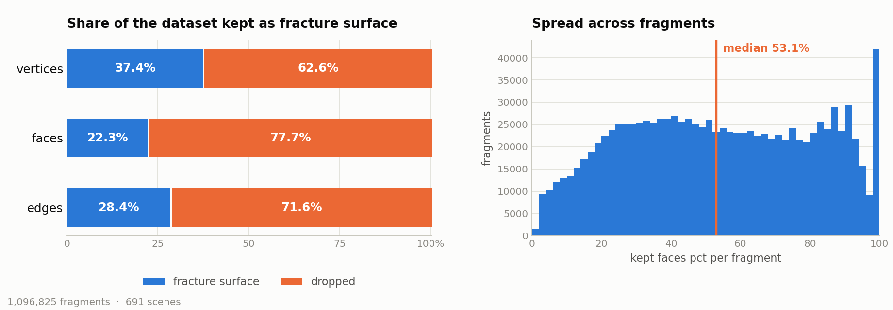

# Equivariant 3D Fracture Reassembly

Reassembling a shattered object from its fragments, with an SO(3)-equivariant
graph network trained on commodity hardware.

M.Sc. thesis project, built on the [Breaking Bad](https://breaking-bad-dataset.github.io/)
dataset. The data and geometry layer, the equivariant network and the training
engine are all here; the translation solver is not. Nothing has been trained on
the real dataset yet — see [Status](#status) before you plan around it.

**New here, or picking the project back up?** Start with
[`docs/PROJECT-STATE.md`](docs/PROJECT-STATE.md) — the pipeline, what the dataset
turned out to contain, every design decision and its evidence, and what is still
missing. [`docs/design-notes.md`](docs/design-notes.md) holds the technical
detail, and [`docs/figure-review.md`](docs/figure-review.md) checks the
explanatory GAT / VN / V-GAT posters against what the layers actually have to
satisfy — the V-GAT one specifies a layer that is **not** equivariant, so read
that before implementing anything from it.

<picture>
  <source media="(prefers-color-scheme: dark)" srcset="docs/fracture_reduction_dark.png">
  
</picture>

> Rendered from the full dataset with
> `python -m scripts.plot_fracture_stats --stats out/stats_true.csv --both-themes`.

Over the full dataset — 1,096,825 fragments across 1,442 objects, extracted in
about an hour on 4 workers — the fracture surface is a small part of each mesh:

| | of all vertices | of all faces | of all edges |
|---|---|---|---|
| **removed** (original exterior) | **89.4%** | **93.8%** | **92.4%** |
| kept as fracture surface | 10.6% | 6.2% | 7.6% |

Size-weighted totals (`1 − Σkept / Σoriginal`) from the **coincidence** ground
truth: a vertex is fracture surface exactly when another fragment has a vertex
at the same point, which Breaking Bad makes decidable because fragments are
stored in their assembled frame.

The *per-fragment mean* is much lower — 49.9% of vertices — because most
fragments are small and small fragments are mostly fracture surface. Both are
reported because averaging percentages answers "what happens to a typical
fragment", not "how much data survives". The median fragment keeps **125
fracture vertices** out of 296.

> The `dihedral` heuristic, which is what you can compute at inference on a
> fragment in isolation, over-labels by **~3.9×** at its default threshold
> (precision 0.24, recall 0.93 against this ground truth). It also lights up
> handles, rims and feet — sharp because the object was *designed* that way. See
> [`docs/design-notes.md`](docs/design-notes.md) §4 and §9.

## What problem this solves

Given the fragments of a broken object, each in an arbitrary pose, recover the
rigid transform that puts every fragment back where it belongs.

The state of the art, [GARF](https://arxiv.org/abs/2504.05400), reaches 6.1°
rotation RMSE — but takes 4×H100 for 72 hours. **The thesis question is whether
equivariance can substitute for scale**: whether a network that is
SO(3)-equivariant *by construction* needs to see far fewer examples than one
that must learn rotational invariance from data, and can therefore be trained
on a 2×T4 budget.

Two commitments follow from that:

**Equivariance instead of augmentation.** A conventional network sees two
rotated copies of one fragment as unrelated inputs and must learn the same
geometry many times over. An equivariant layer satisfies `L(R·x) = R·L(x)` as an
algebraic property, so the rotation is free.

**Rotation and translation are separate problems.** Orientation needs semantic
understanding of how fragments relate. Translation, once orientations are known,
is a well-posed geometric optimisation over matched interface points — it does
not need to be learned at all.

## Why fracture surfaces matter

A fragment's surface is two different things glued together: the object's
**original exterior** (smooth, and shared with no one) and the **fracture
surface** where it tore away from its neighbours (jagged, and matching exactly
one other fragment).

The fracture surface carries the *exact mating* information — one surface fits
exactly one other. Separating it out is what `reassembly.mesh.fracture` does.

It is not the only useful signal, though: a rim broken across three fragments
still has to close into one circle, and a handle split in two still has to
rejoin. Those constraints live on the *original* surface. So fracture-ness can
either **gate** the cross-fragment graph or ride along as a per-token
**feature** — GARF does the latter, attending over all its sampled points and
using fracture segmentation only as a pretraining objective. Both are
implemented; see [`docs/design-notes.md`](docs/design-notes.md) §4.

Two independent labellings are available:

| method | what it uses | available at inference? |
|---|---|---|
| `dihedral` | sharp dihedral variation within one fragment | **yes** — one fragment in isolation |
| `coincidence` | vertices another fragment also occupies | no — needs the assembled scene |

`coincidence` is ground truth (this is how GARF derives its supervision);
`dihedral` is the estimate a model can compute at test time.
`scripts/tune_sharp_threshold.py` scores one against the other across a sweep,
so `--sharp-threshold` is chosen by measurement rather than by eye. It reports
recall-weighted **F-beta** rather than F1, because a missed fracture face is an
edge the model never sees while a spurious one is only noise.

## Requirements

- Python ≥ 3.10
- `numpy`, `scipy`, `libigl`, `trimesh` — see [`requirements.txt`](requirements.txt)
- `torch` ≥ 2.2 for the network and training (install from the **default** PyPI
  index; `download.pytorch.org` is blocked on some networks and the CUDA wheels
  are on PyPI anyway)
- `pandas` for the summary tables and figures; `matplotlib` for the figures
- The Breaking Bad dataset (not redistributable — [download it here](https://breaking-bad-dataset.github.io/))

**The test suite does not need `libigl`.** It builds its meshes in
`conftest.py`, so if libigl gives you trouble on your platform the tests still
run with `numpy scipy trimesh torch pytest` alone. Without `torch` the geometry
tests still pass and the network tests skip.

## Install

```bash
git clone <this-repo> && cd <this-repo>
python -m venv .venv && source .venv/bin/activate      # Windows: .\.venv\Scripts\Activate.ps1
pip install -e ".[dev]"
python -m pytest                                        # 290 passed
```

Installing is optional — `pytest.ini` sets `pythonpath = src .` and each script
prepends `src` itself, so everything runs from a clone.

### Dataset layout

Point `--root` at the directory *containing* the subset folders:

```
<root>/everyday_compressed/everyday_compressed/<category>/<object>/
<root>/artifact_compressed/artifact_compressed/<object>/
    compressed_mesh.obj                       intact fine mesh
    compressed_data.npz                       sparse cell → fine-vertex matrix
    fractured_<k>/compressed_fracture.npy     cell → piece label
    mode_<k>/compressed_fracture.npy
```

Scene discovery walks until it finds directories holding `compressed_mesh.obj`,
so extra nesting is tolerated. A wrong `--root` gives
`no scene directories found under ...` rather than a wrong answer.

## Usage

### Look at a scene

```bash
python -m scripts.visualize --root /path/to/data
```

A random scene, fracture mode and perturbation each run — and the seed is
printed, so any view can be pinned:

```
scene     everyday_compressed/Bottle/obj_F
mode      fractured_1  (4 available)
seed      599617297   (--seed 599617297 to see this exact scene again)
fragments 2
load      mesh+matrix     15.4 ms   (once per scene, amortised over 4 modes)
          fragments        1.8 ms   (per sample; 0.9 ms/fragment)
          total           17.2 ms
```

| | |
|---|---|
| `--show fracture` | draw only the extracted fracture surfaces |
| `--show both` | fragments and surfaces side by side |
| `--method coincidence` | draw the ground-truth labelling instead of the heuristic |
| `--diffuse` | apply a random SE(3) transform per fragment |
| `--seed N` | pin the scene, mode and perturbation |
| `--scene NAME --mode NAME` | pin them directly |
| `--export out/scene.glb` | write a file instead of opening a window |
| `--no-show` | print the table and timings only |
| `--repeat N` | re-time the load N times, report best and median |

An interactive window needs `pip install "pyglet<2"`; `--export` and
`--no-show` do not.

The load timing is split because the halves behave differently under a batch
loader: `mesh+matrix` is parsed once per scene and reused across its ~100 modes,
while `fragments` is the per-sample cost. Both `igl` and `trimesh` are imported
before the clock starts — measured cold, the first load pays ~500 ms of
`import trimesh` against ~2 ms of actual work.

### Extract fracture surfaces over the whole dataset

```bash
python -m scripts.extract_fracture_surfaces --root /path/to/data --dry-run
python -m scripts.extract_fracture_surfaces --root /path/to/data --workers 4 \
    --min-fracture-faces 1 \
    --masks-dir out/masks --stats-csv out/stats.csv --summary-csv out/summary.csv
```

`--min-fracture-faces 1` guarantees a non-empty labelling. Every fragment of a
broken object tore away from a neighbour, so it has fracture surface by
definition — but the dihedral test is an *absolute* angle threshold while
roughness is relative to triangle size, so a small, gently curved shard can have
no adjacency above the threshold and come out empty. The flag relaxes the
threshold for **those fragments only**, leaving every other fragment
bit-identical. Pick the global threshold with evidence instead of by eye:

```bash
python -m scripts.tune_sharp_threshold --root /path/to/data --limit 200 --workers 4
```

which sweeps thresholds against the coincidence ground truth and reports
precision, recall, F1 and the empty-fragment rate for each.

Deterministic order, resumable (`--resume`), interrupt-safe, and bounded by
`--time-budget` for session-limited machines. `--limit 20` gives a number in a
minute.

Storing every fracture surface as a mesh would be ~10 GB; the default writes
**packed-bit masks** instead — about one bit per face, under a gigabyte for the
whole dataset, from which the surfaces reconstruct exactly:

```python
from scripts.extract_fracture_surfaces import load_masks
masks = load_masks("out/masks/everyday_compressed__cat__obj/fractured_3.npz")
```

### Figures and analysis

```bash
python -m scripts.plot_fracture_stats  --stats out/stats.csv --both-themes
python -m scripts.analyze_graph_cost   --stats out/stats.csv --plot docs/graph_cost.png
```

`analyze_graph_cost` measures how many attention connections the fracture-surface
graph creates per scene, against GARF's cost as a reference. It exists because
cross-fragment attention over fracture vertices is **quadratic in fracture-vertex
count**, while GARF samples a fixed 5000 points per object regardless of mesh
resolution — so the comparison decides whether the design needs sub-sampling.

## Code tree

```
src/reassembly/
├── arrays.py                      int64 key encoding, grouping, index compaction
├── mesh/
│   ├── topology.py                half-edges, adjacency, unique edges, safe normals
│   ├── repair.py                  resolve_duplicated_faces (vectorised)
│   ├── fracture.py            ★   fracture-surface extraction, both methods
│   ├── orientation.py             canonical edge face-normal ordering
│   ├── patches.py                 fracture-surface patches for cross-attention
│   ├── correspondence.py          cross-fragment coincidence matching
│   └── shell.py                   ray-cast visibility (unused; kept for figures)
├── data/
│   ├── paths.py                   scene discovery, subsets, official splits
│   ├── scene.py                   SceneReader — caches the intact mesh across modes
│   ├── transforms.py              SE(3) perturbation, centring, normalisation
│   └── features.py                meshes → tensors, and the batch collate
├── training.py                 ★  config, dataset, loops, checkpoints, metrics
├── nn/
│   ├── vn.py                  ★   Vector Neuron primitives, Gram-Schmidt head
│   ├── segment.py                 scatter reductions (no torch_scatter)
│   ├── gat.py                     intra-fragment attention along mesh edges
│   ├── cross.py               ★   cross-fragment attention — read its docstring
│   ├── losses.py                  the composite objective, verified chance values
│   └── model.py                   the backbone and the rotation convention
└── viz/scene.py                   scene assembly for rendering

scripts/
├── extract_fracture_surfaces.py   exhaustive pass over the dataset
├── plot_fracture_stats.py         the README figure
├── analyze_graph_cost.py          graph size vs GARF
├── tune_sharp_threshold.py        pick --sharp-threshold by F1
└── visualize.py                   render or describe one scene

tests/                             290 tests, no skips
```

Only `reassembly` is packaged; `scripts/` and `tests/` are entry points and
checks, run from the repository root.

## Status

**Implemented and tested:** data loading, scene discovery, official splits,
mesh topology, fracture-surface extraction (both methods), cross-fragment
correspondence, SE(3) perturbation, visualisation, the exhaustive extraction
pass — and the network: Vector Neuron primitives, intra-fragment graph
attention, cross-fragment attention, the composite loss, feature construction
and the batch collate.

Equivariance is checked numerically in float64, not asserted in prose. Every
primitive satisfies `L(xRᵀ) = L(x)Rᵀ` to ≤1e-15; the whole model is equivariant
to a fragment's own pose and *invariant* to every other fragment's, which is
the property that makes a per-fragment rotation label learnable at all.

**Training** is in `reassembly.training` — one module holding the config, the
dataset, the loops, checkpointing, the schedule and the metrics. It prints every
loss term separately each epoch alongside the total, with chance in the banner
so a number can be read against something:

```bash
python -m scripts.train --root /path/to/breaking_bad --epochs 40
python -m scripts.train --root /path/to/breaking_bad --evaluate
```

On Kaggle's two T4s, `devices=2` spawns one process per GPU — from a *file*,
not a notebook cell (`scripts/train.py` explains why). It refuses to print a
verdict a run did not earn: a result at chance, one parked at the 89.9°
axis-only floor, and one still descending at its cutoff are each flagged for
what they are.

### Before you spend a session: preflight

```bash
python -m scripts.train --root /kaggle/input/breaking-bad --preflight
```

Runs in a few minutes, trains nothing, and exits non-zero if it is not safe to
proceed. The local test suite proves the maths, but it runs on synthetic meshes
on CPU — none of the failures that actually cost a Kaggle session are visible
from there. Preflight checks the things that are:

| | |
|---|---|
| GPUs, memory, CPU count | `devices=2` on a one-GPU machine, workers oversubscribed |
| `out_dir` writable *now* | Pointing at `/kaggle/input` otherwise fails at the first checkpoint, hours in |
| Objects, samples, split source | **No official split file** means a silent fallback to a hashed one, and numbers that are not comparable to published results |
| Train/val object overlap | Validation measuring memorisation |
| Real scene sizes | Fragments, vertices and tokens per scene — and whether the fracture mask came out empty |
| Forward + backward on the **largest** sampled scene | Peak GPU memory against the card, and OOM caught here rather than mid-epoch |
| Every parameter receives gradient | A layer silently not in the model |
| Loss at initialisation vs chance | A term far from its reference is measuring something other than its name |
| Measured seconds/step | Projects epoch time, total time, **and how many sessions it will take** |

If it reports that even `batch_size=1` will not fit, turn the knobs in this
order — the first two do not change what the model can represent, the third
does:

```bash
--checkpoint-intra          # recompute the intra-layer projections too
--channels 32               # half the width
--tokens-per-scene 1024     # fewer cross-fragment tokens; changes the model
```

Cross-attention checkpointing is already on by default (`--no-checkpoint-cross`
turns it off). It is what makes 2048 tokens fit at all: the pair gathers cost
1109 bytes per pair when stored against 86 when recomputed, which at a
3.5-million-pair scene is 3.6 GB against 0.3 GB *per cross layer*. Outputs and
gradients are bitwise identical either way.

### Training across Kaggle's 12-hour cap

A full training set takes more than one session, so a run is a *chain* of them.
Session one:

```python
from reassembly.training import Config, train
if __name__ == "__main__":                       # required for devices=2
    train(Config(root="/kaggle/input/breaking-bad",
                 out_dir="/kaggle/working/vgat", devices=2, epochs=40))
```

Save the notebook version so `/kaggle/working` becomes an output, add that
output as an input dataset to the next session, and point at it:

```python
train(Config(root="/kaggle/input/breaking-bad",
             resume_from="/kaggle/input/<previous-output-name>",
             out_dir="/kaggle/working/vgat", devices=2, epochs=40))
```

`out_dir` must stay under `/kaggle/working`; `/kaggle/input` is read-only, and
the run checks that before training rather than at the first checkpoint.

It stops at `max_hours=11` with a checkpoint written, checkpoints every 30
minutes in case one epoch outlasts a session, catches the SIGTERM Kaggle sends,
restores optimiser moments and RNG state, refuses to resume onto a different
architecture, warns loudly if the *data* settings changed (that one raises
nothing on its own), and tracks cumulative training time so the banner can
project how many more sessions are left:

```
  ~1:04:12/epoch, 31 epoch(s) left = ~33:10:12  (4 more session(s) at 11h)
```

**Not in this repository yet:** the translation solver (stage two).

An earlier VN-GAT implementation fit small subsets (43° train error against a
126.5° chance baseline) but did not generalise — validation stayed near 94–102°
at every dataset size, which is close to the ~89.9° floor expected if a model
recovers a fragment's axis but not its azimuth. That result is what motivated
the current redesign, in which cross-fragment attention runs over
fracture-surface vertices rather than virtual nodes.

Reference values used throughout, worth checking any number against:

| quantity | value |
|---|---|
| chance geodesic error (uniform residual) | 126.48° = π/2 + 2/π |
| chance Euler RMSE, **random** prediction | 86.29° |
| chance Euler RMSE, **identity** prediction | 83.14° |
| "axis correct, azimuth random" geodesic | 89.9° |
| untrained `L_normal`, `L_face` | 1.0, 2.0 |
| `L_position` on the unit sphere | 4/3 |

All measured by Monte Carlo in `tests/test_losses.py`.

Two things worth knowing about these. Euler RMSE and geodesic error are **not**
the same metric on the same prediction — a 30° single-axis error is 30°
geodesic but ≈17.3° Euler RMSE, and GARF's tables use Euler RMSE, so always say
which. And "chance" has two values: predicting the *identity* every time scores
83.14° Euler RMSE, three degrees **better** than guessing randomly. Since
collapsing to near-identity is the cheapest early way to reduce a rotation loss,
a model can appear to beat chance on the headline metric while having learned
nothing. Geodesic error is 126.5° for both, so it does not pay for the collapse.

## Notes on the implementation

- `topology.unique_edges` defines the canonical edge ordering for the package.
  `trimesh.edges_unique` returns the same set in a different order; mixing the
  two silently misaligns every per-edge attribute.
- `resolve_duplicated_faces` returns faces ordered by sorted vertex triple, not
  in input order. Per-face artifacts (the packed masks) index by position, so
  this is part of the contract — do not "tidy" it by sorting.
- `diffuse_fragments` takes an explicit `numpy.random.Generator`. Drawing from
  global `np.random` gives correlated streams across DataLoader workers.
- `Scene.object_key` collapses fracture-mode variants, so `count_objects()`
  reports distinct shapes (746) rather than scene directories (1,442).

## Citation

Built on Breaking Bad (Sellán et al., NeurIPS 2022 Datasets & Benchmarks) and
informed by GARF (Li et al., 2025), Vector Neurons (Deng et al., ICCV 2021), and
Tensor Field Networks (Thomas et al., 2018).
