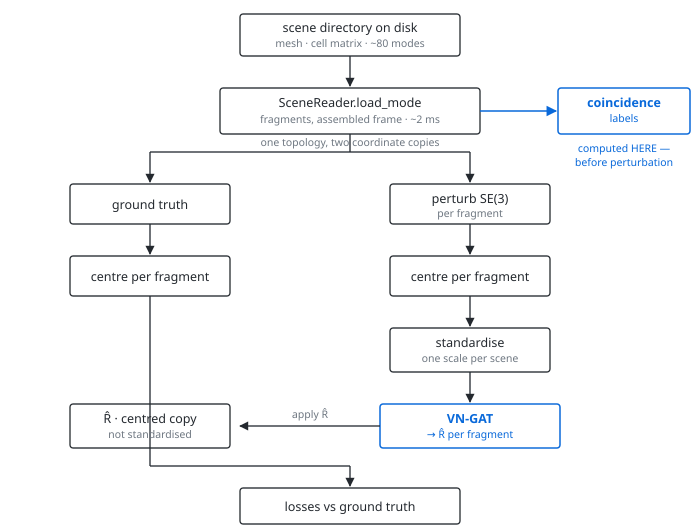

# Where the project stands

Orientation document: everything decided, measured and built so far — the data
pipeline, what the dataset turned out to contain, each design choice and the
evidence behind it, and what the model still needs.

`docs/design-notes.md` holds the technical detail; this page is the layer above it.
`docs/figure-review.md` reviews the GAT / VN / V-GAT explanatory posters — the
V-GAT one specifies a layer that is **not** equivariant, so read that before
implementing anything from it.

| | |
|---|---|
| Pipeline | **built** — 283 tests, clean under `-W error` |
| Dataset pass | 1,096,825 fragments across 1,442 objects |
| Fracture surface | 10.6% of vertices, dataset-wide |
| Model | **built and verified** — equivariance checked numerically in float64 |
| Training | **built** — loops, checkpoints, schedule, metrics, 2-GPU |
| Trained result | **none yet** — nothing has been run on the real dataset |
| First preflight | found a train/val split overlap and an OOM; both fixed |

---

## 1 · The question

Given the fragments of a broken object in arbitrary poses, recover the rigid
transform that puts each one back. The state of the art, GARF, reaches 6.1°
rotation RMSE using 4×H100 for 72 hours. The thesis asks whether **equivariance
can substitute for scale**: a network that is SO(3)-equivariant by construction
never has to learn the same geometry twice under different rotations, so it
should need far less data and compute. Target hardware is 2×T4.

Two commitments follow, and everything below serves them.

**Equivariance.** A layer satisfying `L(R·x) = R·L(x)` as an algebraic property
gets rotation for free, instead of learning it from augmented data.

**Two stages.** Rotation is learned; translation is *solved*. Once orientations
are known, placement is a geometric optimisation over matched interface points —
it does not need a network at all.

---

## 2 · The data pipeline

One scene directory holds an intact fine mesh plus ~80 fracture modes, each a
labelling of mesh cells into pieces. `SceneReader` parses the mesh and the sparse
cell matrix *once* and reuses them across every mode, which is the single largest
saving on a full pass.

<picture>
  <source media="(prefers-color-scheme: dark)" srcset="pipeline_dark.svg">
  
</picture>

The two copies share one topology and differ only in coordinates — the losses
match vertices, edges and normals **by index**, so a second independently built
copy would compare unrelated rows without raising anything.

### Two bugs already caught here

Both were silent: right shapes, finite numbers, a loss that still descends.

- **Perturbing before computing coincidence** gives every fragment an empty
  fracture surface. Coincidence is defined in the assembled frame; once
  `diffuse_fragments` has scattered the pieces, nothing coincides.
- **Building the two copies independently** lets `resolve_duplicated_faces`,
  which reorders faces lexicographically, produce two different vertex orderings.
  Assert `gt.edge_index == diffused.edge_index` in the collate function.

---

## 3 · What the dataset actually contains

A full pass over 1,442 objects and 1,096,825 fragments, using the **coincidence**
ground truth — a vertex is fracture surface exactly when another fragment has a
vertex at the same point, decidable because Breaking Bad stores fragments in
their assembled frame.

| Quantity | Median | Mean | Max |
|---|---|---|---|
| Vertices per fragment | 296 | 1,550 | 83,039 |
| Fracture vertices | 125 | 164 | 3,587 |
| Fragments per scene | 3 | 8 | 99 |

Dataset-wide, the fracture surface is **10.6% of vertices, 6.2% of faces, 7.6% of
edges**.

Two reduction numbers are reported because they answer different questions and
diverge sharply: the **per-fragment mean** (49.9% of vertices removed) weights
every fragment equally, while the **dataset aggregate** (89.4%) weights by size.
Most fragments are small and small fragments are mostly fracture surface, so the
typical fragment loses half its vertices while the dataset loses nine tenths.

### The graph is far cheaper than expected

Because the true fracture surface is small, connecting every fracture vertex to
every fracture vertex of every *other* fragment is affordable with no reduction
at all:

| Fragments | Cross-fragment pairs | vs GARF's 6-layer stack |
|---|---|---|
| 3 (median scene) | 46,875 | 0.001× |
| 8 (mean scene) | 753,088 | 0.01× |
| 20 | 2,968,750 | 0.04× |
| 99 (largest) | 75,796,875 | 1.01× |

Cost is `7812.5·n(n−1)`, crossing GARF's whole stack at n ≈ 99 — exactly the
largest scene in the dataset — and staying under 10% up to n ≈ 32.

**So reduction is not needed for cost.** It was designed against the dihedral
mask, which over-labels by 3.9×; the real numbers make the unreduced graph
viable. Sampling is still used — not to make the graph affordable, but to make
the inter-fragment connection count *fixed and predictable* rather than a
function of whatever mesh happens to arrive.

---

## 4 · Features and preprocessing

Vector Neuron features are shaped `(C, 3)`; rotation acts on the last axis, so
`x → x Rᵀ`. Anything without a direction cannot live in that tensor.

| Level | Feature | Type |
|---|---|---|
| Node | centred coordinate + vertex normal | `(2, 3)` vector |
| Edge | two adjacent face normals + relative position `p_src − p_dst` | `(3, 3)` vector |
| Fragment | scale | invariant **scalar** |

Midpoint and edge length are dropped from the earlier design. Scale conditions
the vector stream through a gate rather than joining it:

```python
gain = softplus(MLP([Gram(x), log_scale]))   # invariant
x    = gain[..., None] * x                    # still equivariant
```

Use `log(scale)`, standardised. Fragments span 4 to 83,039 vertices, so raw scale
is heavy-tailed and would dominate whatever it is concatenated with. GARF applies
a positional encoding for the same reason.

### What may cross between fragments — the constraint that shapes the design

Each fragment is perturbed by its **own** rotation, so the label for fragment
*i* does not change when fragment *j* lands at a different angle. The
prediction must not either. Writing `A` for a rotation applied to one
fragment's input, fragment *i*'s representation has to satisfy both lines:

```
H_i(P_1, …, P_i A, …, P_N) = H_i(…) · A
H_i(P_1, …, P_j A, …, P_N) = H_i(…)          (j ≠ i)
```

Equivariant to its own pose; **invariant to every other fragment's**. This is
equation 7 of *Leveraging SE(3) Equivariance for Learning 3D Geometric Shape
Assembly*, and it is why their correlation module is `C_ij = G_j · F_i` — an
*invariant* matrix from the sender multiplying the *receiver's own* equivariant
features.

Note what this does **not** say. It is not "no vectors between fragments" —
`nn/cross.py` is a Vector Neuron layer throughout: `(T, C, 3)` in, `(T, C, 3)`
out, equivariant on the spatial axis at every step. The constraint is on what a
message may *depend on*, and within it the message is as rich as it can be: a
full `(C/H, C/H)` **channel-mixing matrix** per head, read off the sender's
invariants and applied to the receiver's own vector features. The sender
re-mixes the receiver's channels arbitrarily; what it cannot do is contribute a
direction of its own, because a direction carries an orientation.

```
logits_ij = ⟨q(inv_i), k(inv_j)⟩ / √d           invariant to both poses
out_i     = x_i + ( Σ_j α_ij G_j ) x_i          G_j invariant, x_i equivariant
```

Because `G` is *linear* in those invariants, `Σ_j α_ij G(v_j) = G(Σ_j α_ij v_j)` —
the sum runs on the small invariant vectors and the matrix is built once per
query. Not cosmetic: a matrix per *pair* would be gigabytes at the two million
pairs a large scene reaches, against a couple of megabytes per token.

The scores cannot be vector inner products either. `⟨W_q x_i, W_k x_j⟩` becomes
`⟨A_i a, A_j b⟩` under independent perturbations, which depends on the relative
rotation — the noise. Same argument, same conclusion.

Nothing is lost by the restriction: the relative orientation of two arbitrarily
tumbled fragments *is* the perturbation, not the object. Shape is the signal and
shape survives.

Measured: own-pose equivariance 8.9e-16, other-pose invariance 8.9e-16 against
outputs of order 1, and the mixing matrix is full rank with off-diagonal
magnitude 0.8× the diagonal — a real channel mix, not a per-channel gain.

### Edge normal ordering — implemented and tested

With midpoint and length gone, `(n₁, n₂)` is most of an edge's signal, so a
swapped pair is a silently wrong input. The order comes from the sign of
`(n₁ × n₂) · d` — invariant under proper rotation because `det R = 1`, and
ambiguous only when the normals are parallel, which is exactly when both slots
hold the same vector. Face-array order would *not* be stable; `test_orientation.py`
asserts that.

---

## 5 · Decisions, and the evidence for each

| Question | Decision | Why |
|---|---|---|
| Which fracture labels? | **Coincidence** for measurement; **dihedral** for the first training run | Coincidence is exact but training-time only. Dihedral over-labels 3.9× (precision 0.24) yet is available at inference, so it keeps train and test consistent. Coincidence is how you measure the gap. |
| Gate or feature? | **Gate on the token pool, not on the graph** | All vertices stay nodes with full features and mesh edges; the mask only decides which vertices may be *sampled* as cross-fragment tokens. This sits between the two extremes — GARF's pure-feature route stays available via `eligible_mask`, and the ablation is one argument. |
| Graph reduction? | **FPS sampling of the masked vertices** | Not needed for cost (unreduced is 0.001× GARF at the median scene) but chosen for a *fixed, predictable* inter-fragment connection count. `mode="sample"` selects deterministically and rotation-invariantly. |
| How is the token budget capped? | **One number: `total=2048` per scene, no per-fragment cap** | The total alone bounds the graph — the pair count is `(T² − Σt_i²)/2 < T²/2` for *any* split, so 2048 can never exceed 0.03× GARF's stack however lopsided. A cap does not tighten that by a single pair, and it destroys the area proportionality: a head statue with both ears, the nose and hair broken off would hand the head — carrying four mating surfaces — the same 128 tokens as one ear. An earlier version of this row argued for both limits on the grounds that a total alone starves the tail; true, but a cap cannot cure starvation, and the fix is a larger total. |
| Standardise how? | **Per scene**, not per fragment — *implemented, default* | Mating surfaces are the same size in world units. Per-fragment normalisation destroys that and asks the network to undo it from the scale feature. `normalize_fragments(fragments)` defaults to `mode="scene"`; `mode="fragment"` is GARF's convention. |
| Which vertices are nodes? | **All of them** | The fracture mask gates only which vertices may be *sampled as cross-fragment tokens*. Every vertex keeps its features and its mesh edges. |
| Which sampler? | **Farthest-point**, not dart-throwing | GARF uses Poisson-disk. FPS gives approximately the same blue-noise coverage on a fixed point set but is deterministic and exactly rotation-invariant, so the same fragment selects the same vertices in every pose. Dart-throwing depends on an RNG stream unrelated to the geometry. |
| Which distance? | **Geodesic** — along the fracture surface, Dijkstra on edges with both endpoints on the break | A fracture surface is a thin strip wrapping a curved fragment; straight-line distance measures *through the material*, so two points on opposite arms of a folded strip read as neighbours and tokens bunch. Measured on a folded strip, geodesic roughly doubles the minimum separation at tight budgets. It is also *cheaper* on large fragments (7.9 ms vs 13.4 ms at 10k vertices) and handles disconnected fracture patches with no special case. `metric="euclidean"` stays as the ablation. |
| Sample where? | **Inside each fragment**, never over the pooled scene | At input time the fragments are in arbitrary perturbed poses, so one global pass would pick points by where the pieces landed — a different sample per perturbation, and no equivariance left. |
| Labels for the first run? | **Dihedral** | Less accurate than coincidence, but it is what exists at inference — so train and test see the same labelling, with no distribution shift to misattribute later. |
| Rotation output? | **6D → Gram-Schmidt** | Two equivariant 3-vectors orthonormalised into a proper rotation. Quaternion regression is not equivariant under a linear map from vector features. |
| Geodesic loss? | **atan2**, not arccos | `arccos`'s gradient diverges as the model converges, crowding out every other term. Clamping turns that into an error floor instead. |
| Embedding loss? | **Centroid variance** | The design document's `‖Σz‖²` is minimised by embeddings that *cancel*, not agree — two opposite vectors score better than two identical ones. |

---

## 6 · The model, as designed

Every fragment is already a graph: mesh vertices are nodes, mesh edges are edges.
**Nothing new is built inside a fragment.** The only constructed connections are
between fragments.

1. **Intra-fragment layers** (~4) — equivariant graph attention along real mesh
   edges. Attention scores are invariant inner products, so weighting equivariant
   messages by them stays equivariant.
2. **Inter-fragment layers** (~2) — attention among fracture-surface tokens across
   *different* fragments of the *same scene*. This replaces the virtual nodes of
   the earlier design.
3. **Head** — two equivariant 3-vector channels per fragment, Gram-Schmidt into
   R̂, plus vertex and edge embeddings.

### The batching rule that is not optional

Cross-fragment attention is segmented **by scene**, not by batch. A batch
concatenates unrelated objects and fragment ids are globally unique, so unmasked
attention lets fragments of different scenes exchange information — making the
prediction depend on batch composition. This exact bug is in the project's
history. Keep both a `batch` vector (for scatter ops) and a `ptr` of cumulative
offsets (GARF's `cu(ℓ)`, for varlen kernels), and sort by `(scene, fragment)`
first so segments are contiguous.

### Stage two: translation

Not learned. Interface correspondences come from mutual nearest neighbours in
embedding space, then translations are solved globally by minimising surface
coincidence, normal cancellation and collision. Centring must stay reversible so
the original per-fragment centroids can be recovered.

---

## 7 · Training plan

| | |
|---|---|
| Losses | geodesic rotation (atan2) · node position · node normal cosine · adjacent face normals · embedding consistency (centroid form). Weights all 1.0, untuned. |
| Precision | fp32. AMP measurably degraded results before, and attention scores overflow in fp16 once products exceed ~256. |
| Budget | 2×T4, 12-hour session cap. Checkpoints must always write a current state, not only a best-so-far. |
| Split | Official Breaking Bad: 407 train / 91 val on Everyday. Artifact held out for a cross-domain test. |

### Reference values — check every number against these

All measured by Monte Carlo in `tests/test_losses.py`, not assumed.

| Quantity | Value |
|---|---|
| Chance geodesic error | 126.48° = π/2 + 2/π |
| Chance Euler RMSE, **random** prediction | 86.29° |
| Chance Euler RMSE, **identity** prediction | 83.14° |
| Axis correct, azimuth random | 89.9° |
| Untrained `L_normal`, `L_face` | 1.0, 2.0 |
| `L_position`, unit sphere | 4/3 |
| Perfect prediction, any term | 0 (geodesic exactly; others to the 1e-8 norm floor) |

**The 83.20° previously recorded here as "chance Euler RMSE" is the wrong
baseline, and the mistake is instructive.** It is the score for predicting the
*identity* every time, not for guessing randomly — and predicting the identity
scores three degrees *better* than guessing. A model that collapses to
near-identity, which is the cheapest early way to reduce a rotation loss, would
therefore appear to beat chance on GARF's headline metric while having learned
nothing. Geodesic error reads 126.5° for both, so it does not pay for the
collapse. Report geodesic as primary and Euler RMSE only for comparability.

Euler RMSE and geodesic error are also not the same metric on the same
prediction — a 30° single-axis error is 30° geodesic but ≈17.3° Euler RMSE.
Always say which.

The previous VN-GAT fit small subsets (43° train error against a 126.5° chance
baseline) but validation never went below ~94° at any dataset size — close to the
89.9° floor expected if a model recovers a fragment's axis but not its azimuth.
That is what the cross-fragment redesign is meant to fix: a one-shot per-fragment
canonicaliser has no access to relative pose, so azimuth is unrecoverable.

---

## 8 · Built versus not built

**Built** — scene discovery and splits · `SceneReader` · mesh topology, repair,
unique edges, safe normals · fracture extraction, both methods · canonical edge
normal ordering · fracture patches / sampling / budgeting · cross-fragment
correspondence · SE(3) perturbation · visualiser · exhaustive extraction pass ·
three analysis scripts · **Vector Neuron primitives · segment reductions ·
intra-fragment VN-GAT · cross-fragment attention · the composite loss · feature
construction and batch collate · the backbone and rotation head**. 283 tests,
no skips.

**Not built** — the translation solver (stage two).

**Built since** — `reassembly.training`: config, the Breaking Bad dataset,
train/val/test loops, warmup-cosine schedule, checkpoint and resume, history,
GARF-comparable metrics, two-GPU DDP, and resume across Kaggle sessions
(`max_hours`, mid-epoch checkpoints, `resume_from` a read-only input, SIGTERM
handling, cumulative time tracking, and a refusal to resume onto a changed
architecture).

Verified end to end on **synthetic** scenes — icospheres with random dents, not
Breaking Bad — where it fits a memorisable set of six from 126.5° to 23.8°.
That result says exactly one thing: the conventions are self-consistent and the
architecture can fit. A transposed rotation label or a misaligned loss row could
not produce it.

It says **nothing** about generalisation, and an earlier version of this
paragraph claimed more than that. It described 23.8° as clearing "the 89.9°
axis-only floor the previous design could not clear" — conflating training and
validation error. The previous VN-GAT reached **43° on training data** and
stalled at ~94° on *validation*; 89.9° is a validation floor. A training number
cannot clear it, because training error was never what was stuck there. The
comparison was not evidence of anything and has been withdrawn.

**Verified, no longer assumed.** `torch` installs fine from the *default* PyPI
index (the earlier failure was `download.pytorch.org` being blocked, not torch
being unavailable), so §4–§6 has been executed rather than reasoned about. In
float64:

| Check | Result |
|---|---|
| Every VN primitive, `L(xRᵀ) = L(x)Rᵀ` | ≤ 1e-15 |
| Gram-Schmidt head orthonormal, det = +1 | exact to 1e-16 |
| Intra-fragment attention, equivariance | 1.3e-15 |
| Cross-fragment, own-pose equivariance | 4.4e-16 |
| Cross-fragment, other-pose **invariance** | 3.3e-16 |
| Cross-scene leakage | exactly 0 |
| Whole model, per-fragment equivariance | ≤ 1e-9 (float64 through 6 layers) |
| Rotation label round trip | exact |
| Every parameter receives gradient | 77 / 77 |

**Two bugs the verification caught**, both of the kind that trains without
complaining:

- **Near-identity initialisation that was actually zero.** Zeroing a gate's
  final weight makes its output constant, which zeroes the gradient into
  everything upstream — the whole cross-fragment pathway plus the scale gate,
  31 of 77 parameters, dead on the first steps and waking only as a bias
  drifted. A *small* final weight keeps the layer within 0.14% of the identity
  and every path alive.
- **An epsilon in the wrong place.** `sqrt(s + 1e-8)` perturbs every norm, not
  just the near-zero ones: the head came out orthonormal only to 1e-8 with
  det = 0.99999995, and the geodesic loss had a 5e-9 rad floor at both 0 and
  180°. Clamping the squared sum instead is exact away from zero, and the
  geodesic path takes a far smaller floor because `atan2`'s derivative cancels
  the norm's.

---

## 9 · Open

- **Fragments with zero fracture surface.** Coincidence still reports a minimum of
  0, which should be impossible. Most likely single-fragment modes, where the
  labelling returns all-false by construction — but it needs counting, because
  such fragments get no inter-fragment edges at all.
- **Inference-time labelling.** Coincidence needs the assembled scene, so it is
  unavailable at test time. GARF trains a segmenter on exactly these labels and
  reaches >99.5%. Until that exists, a model trained on perfect labels reports an
  optimistic number — state it in the thesis.
- **Supervision asymmetry.** The embedding-consistency loss is defined over
  coincident vertices, so it only supervises the fracture channel. Tokens from the
  original surface are shaped by the rotation loss alone.
- **Layer counts, loss weights, token budget.** All currently guesses. The loss
  weights are deliberately all 1.0 and untuned: the terms have very different
  natural scales, and the first run should *measure* the relative sizes rather
  than assume them. `ReassemblyLoss` returns every term separately for that.
- **Nothing has been trained.** Every number above is a property of the
  architecture, not evidence that it learns. The training loop, the GARF-metric
  evaluation and the translation solver are next.
