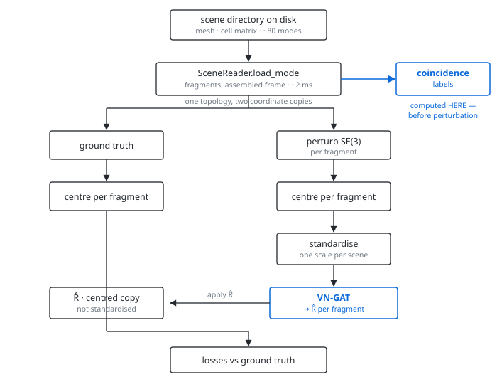

# Where the project stands

Orientation document: everything decided, measured and built so far — the data
pipeline, what the dataset turned out to contain, each design choice and the
evidence behind it, and what the model still needs.

`docs/design-notes.md` holds the technical detail; this page is the layer above it.
`docs/figure-review.md` reviews the GAT / VN / V-GAT explanatory posters — the
V-GAT one specifies a layer that is **not** equivariant, so read that before
implementing anything from it.

| | |
|---|---|
| Pipeline | **built** — 523 tests, clean under `-W error` |
| Dataset pass | 1,096,825 fragments across 1,442 objects |
| Fracture surface | 10.6% of vertices, dataset-wide |
| Model | **built and verified** — equivariance checked numerically in float64 |
| Training | **built** — loops, checkpoints, schedule, metrics; 1, 2 or N GPUs |
| Trained result | **none yet** — nothing has been run on the real dataset |
| First preflight | found a train/val split overlap and an OOM; both fixed |
| Second preflight | found the memory ceiling: cross-attention was 7.2 GB of 15.6 GB, now 0.6 GB |
| Third preflight | `batch_size=2` fits at 76%; preflight itself is now tested end to end |
| First real run | 13 min on 400 objects — caught an embedding loss minimised by collapse |
| Two full epochs | rotation flat at chance after 3,536 steps; OOM guard, DDP skip and both time projections fixed |
| Audit against the earlier design | seven defects found and fixed, two experiment controls added — see §10 |
| Multi-GPU rework | two silent faults (replica drift, collective desync) and five more fixed; stage two, fixed-length epochs, OOM retry, failure tracking, tools — see §11 |
| Thesis v6 | the largest fragment as the anchor: metrics always, loss by default; re-scores My Thesis Work checkpoints — see §12 |
| Benchmark range | `--max_fragments 20` trains and scores on GARF's 2–20 pieces; off by default — see §13 |
| Hub mirror | optional `--hf_repo_id/--hf_local_dir/--hf_token`: files pushed every epoch, pulled into a fresh folder — see §14 |
| Thesis v7 | matched rotations placed from the pair fits the chain agrees with, the anchor held, not one solve over every match; `--evaluate --jitter/--drop` without shared break vertices — see §17 |
| Thesis v7, no head | the rotation head removed: trained on the embedding term alone, every rotation fitted from the matches, the four geometric terms scores only, `best.pt` on validation acc@10; `--split all`, `--predictions` — see §18 |

---

## 1 · The question

Given the fragments of a broken object in arbitrary poses, recover the rigid
transform that puts each one back. The state of the art, GARF, reaches 6.1°
rotation RMSE using 4×H100 for 72 hours. The thesis asks whether **equivariance
can substitute for scale**: a network that is SO(3)-equivariant by construction
never has to learn the same geometry twice under different rotations, so it
should need far less data and compute. Target hardware is 2×T4.

Two commitments follow, and everything below serves them.

**Equivariance.** A layer satisfying `L(R·x) = R·L(x)` as an algebraic property
gets rotation for free, instead of learning it from augmented data.

**Two stages.** Rotation is learned; translation is *solved*. Once orientations
are known, placement is a geometric optimisation over matched interface points —
it does not need a network at all.

---

## 2 · The data pipeline

One scene directory holds an intact fine mesh plus ~80 fracture modes, each a
labelling of mesh cells into pieces. `SceneReader` parses the mesh and the sparse
cell matrix *once* and reuses them across every mode, which is the single largest
saving on a full pass.

<picture>
  <source media="(prefers-color-scheme: dark)" srcset="pipeline_dark.svg">
  
</picture>

The two copies share one topology and differ only in coordinates — the losses
match vertices, edges and normals **by index**, so a second independently built
copy would compare unrelated rows without raising anything.

### Two bugs already caught here

Both were silent: right shapes, finite numbers, a loss that still descends.

- **Perturbing before computing coincidence** gives every fragment an empty
  fracture surface. Coincidence is defined in the assembled frame; once
  `diffuse_fragments` has scattered the pieces, nothing coincides.
- **Building the two copies independently** lets `resolve_duplicated_faces`,
  which reorders faces lexicographically, produce two different vertex orderings.
  Assert `gt.edge_index == diffused.edge_index` in the collate function.

---

## 3 · What the dataset actually contains

A full pass over 1,442 objects and 1,096,825 fragments, using the **coincidence**
ground truth — a vertex is fracture surface exactly when another fragment has a
vertex at the same point, decidable because Breaking Bad stores fragments in
their assembled frame.

| Quantity | Median | Mean | Max |
|---|---|---|---|
| Vertices per fragment | 296 | 1,550 | 83,039 |
| Fracture vertices | 125 | 164 | 3,587 |
| Fragments per scene | 3 | 8 | 99 |

Dataset-wide, the fracture surface is **10.6% of vertices, 6.2% of faces, 7.6% of
edges**.

Two reduction numbers are reported because they answer different questions and
diverge sharply: the **per-fragment mean** (49.9% of vertices removed) weights
every fragment equally, while the **dataset aggregate** (89.4%) weights by size.
Most fragments are small and small fragments are mostly fracture surface, so the
typical fragment loses half its vertices while the dataset loses nine tenths.

### The graph is far cheaper than expected

Because the true fracture surface is small, connecting every fracture vertex to
every fracture vertex of every *other* fragment is affordable with no reduction
at all:

| Fragments | Cross-fragment pairs | vs GARF's 6-layer stack |
|---|---|---|
| 3 (median scene) | 46,875 | 0.001× |
| 8 (mean scene) | 753,088 | 0.01× |
| 20 | 2,968,750 | 0.04× |
| 99 (largest) | 75,796,875 | 1.01× |

Cost is `7812.5·n(n−1)`, crossing GARF's whole stack at n ≈ 99 — exactly the
largest scene in the dataset — and staying under 10% up to n ≈ 32.

**So reduction is not needed for cost.** It was designed against the dihedral
mask, which over-labels by 3.9×; the real numbers make the unreduced graph
viable. Sampling is still used — not to make the graph affordable, but to make
the inter-fragment connection count *fixed and predictable* rather than a
function of whatever mesh happens to arrive.

---

## 4 · Features and preprocessing

Vector Neuron features are shaped `(C, 3)`; rotation acts on the last axis, so
`x → x Rᵀ`. Anything without a direction cannot live in that tensor.

| Level | Feature | Type |
|---|---|---|
| Node | centred coordinate + vertex normal | `(2, 3)` vector |
| Edge | two adjacent face normals + relative position `p_src − p_dst` | `(3, 3)` vector |
| Fragment | scale | invariant **scalar** |

Midpoint and edge length are dropped from the earlier design. Scale conditions
the vector stream through a gate rather than joining it:

```python
gain = softplus(MLP([Gram(x), log_scale]))   # invariant
x    = gain[..., None] * x                    # still equivariant
```

Use `log(scale)`, standardised. Fragments span 4 to 83,039 vertices, so raw scale
is heavy-tailed and would dominate whatever it is concatenated with. GARF applies
a positional encoding for the same reason.

### What may cross between fragments — the constraint that shapes the design

Each fragment is perturbed by its **own** rotation, so the label for fragment
*i* does not change when fragment *j* lands at a different angle. The
prediction must not either. Writing `A` for a rotation applied to one
fragment's input, fragment *i*'s representation has to satisfy both lines:

```
H_i(P_1, …, P_i A, …, P_N) = H_i(…) · A
H_i(P_1, …, P_j A, …, P_N) = H_i(…)          (j ≠ i)
```

Equivariant to its own pose; **invariant to every other fragment's**. This is
equation 7 of *Leveraging SE(3) Equivariance for Learning 3D Geometric Shape
Assembly*, and it is why their correlation module is `C_ij = G_j · F_i` — an
*invariant* matrix from the sender multiplying the *receiver's own* equivariant
features.

Note what this does **not** say. It is not "no vectors between fragments" —
`nn/cross.py` is a Vector Neuron layer throughout: `(T, C, 3)` in, `(T, C, 3)`
out, equivariant on the spatial axis at every step. The constraint is on what a
message may *depend on*, and within it the message is as rich as it can be: a
full `(C/H, C/H)` **channel-mixing matrix** per head, read off the sender's
invariants and applied to the receiver's own vector features. The sender
re-mixes the receiver's channels arbitrarily; what it cannot do is contribute a
direction of its own, because a direction carries an orientation.

```
logits_ij = ⟨q(inv_i), k(inv_j)⟩ / √d           invariant to both poses
out_i     = x_i + ( Σ_j α_ij G_j ) x_i          G_j invariant, x_i equivariant
```

Because `G` is *linear* in those invariants, `Σ_j α_ij G(v_j) = G(Σ_j α_ij v_j)` —
the sum runs on the small invariant vectors and the matrix is built once per
query. Not cosmetic: a matrix per *pair* would be gigabytes at the two million
pairs a large scene reaches, against a couple of megabytes per token.

The scores cannot be vector inner products either. `⟨W_q x_i, W_k x_j⟩` becomes
`⟨A_i a, A_j b⟩` under independent perturbations, which depends on the relative
rotation — the noise. Same argument, same conclusion.

Nothing is lost by the restriction: the relative orientation of two arbitrarily
tumbled fragments *is* the perturbation, not the object. Shape is the signal and
shape survives.

Measured: own-pose equivariance 8.9e-16, other-pose invariance 8.9e-16 against
outputs of order 1, and the mixing matrix is full rank with off-diagonal
magnitude 0.8× the diagonal — a real channel mix, not a per-channel gain.

### Edge normal ordering — implemented and tested

With midpoint and length gone, `(n₁, n₂)` is most of an edge's signal, so a
swapped pair is a silently wrong input. The order comes from the sign of
`(n₁ × n₂) · d` — invariant under proper rotation because `det R = 1`, and
ambiguous only when the normals are parallel, which is exactly when both slots
hold the same vector. Face-array order would *not* be stable; `test_orientation.py`
asserts that.

---

## 5 · Decisions, and the evidence for each

| Question | Decision | Why |
|---|---|---|
| Which fracture labels? | **Coincidence** for measurement; **dihedral** for the first training run | Coincidence is exact but training-time only. Dihedral over-labels 3.9× (precision 0.24) yet is available at inference, so it keeps train and test consistent. Coincidence is how you measure the gap. |
| Gate or feature? | **Gate on the token pool, not on the graph** | All vertices stay nodes with full features and mesh edges; the mask only decides which vertices may be *sampled* as cross-fragment tokens. This sits between the two extremes — GARF's pure-feature route stays available via `eligible_mask`, and the ablation is one argument. |
| Graph reduction? | **FPS sampling of the masked vertices** | Not needed for cost (unreduced is 0.001× GARF at the median scene) but chosen for a *fixed, predictable* inter-fragment connection count. `mode="sample"` selects deterministically and rotation-invariantly. |
| How is the token budget capped? | **One number: `total=2048` per scene, no per-fragment cap** | The total alone bounds the graph — the pair count is `(T² − Σt_i²)/2 < T²/2` for *any* split, so 2048 can never exceed 0.03× GARF's stack however lopsided. A cap does not tighten that by a single pair, and it destroys the area proportionality: a head statue with both ears, the nose and hair broken off would hand the head — carrying four mating surfaces — the same 128 tokens as one ear. An earlier version of this row argued for both limits on the grounds that a total alone starves the tail; true, but a cap cannot cure starvation, and the fix is a larger total. |
| Standardise how? | **Per scene**, not per fragment — *implemented, default* | Mating surfaces are the same size in world units. Per-fragment normalisation destroys that and asks the network to undo it from the scale feature. `normalize_fragments(fragments)` defaults to `mode="scene"`; `mode="fragment"` is GARF's convention. |
| Which vertices are nodes? | **All of them** | The fracture mask gates only which vertices may be *sampled as cross-fragment tokens*. Every vertex keeps its features and its mesh edges. |
| Which sampler? | **Farthest-point**, not dart-throwing | GARF uses Poisson-disk. FPS gives approximately the same blue-noise coverage on a fixed point set but is deterministic and exactly rotation-invariant, so the same fragment selects the same vertices in every pose. Dart-throwing depends on an RNG stream unrelated to the geometry. |
| Which distance? | **Geodesic** — along the fracture surface, Dijkstra on edges with both endpoints on the break | A fracture surface is a thin strip wrapping a curved fragment; straight-line distance measures *through the material*, so two points on opposite arms of a folded strip read as neighbours and tokens bunch. Measured on a folded strip, geodesic roughly doubles the minimum separation at tight budgets. It is also *cheaper* on large fragments (7.9 ms vs 13.4 ms at 10k vertices) and handles disconnected fracture patches with no special case. `metric="euclidean"` stays as the ablation. |
| Sample where? | **Inside each fragment**, never over the pooled scene | At input time the fragments are in arbitrary perturbed poses, so one global pass would pick points by where the pieces landed — a different sample per perturbation, and no equivariance left. |
| Labels for the first run? | **Dihedral** | Less accurate than coincidence, but it is what exists at inference — so train and test see the same labelling, with no distribution shift to misattribute later. |
| Rotation output? | **6D → Gram-Schmidt** | Two equivariant 3-vectors orthonormalised into a proper rotation. Quaternion regression is not equivariant under a linear map from vector features. |
| Geodesic loss? | **atan2**, not arccos | `arccos`'s gradient diverges as the model converges, crowding out every other term. Clamping turns that into an error floor instead. |
| Embedding loss? | **Centroid variance** | The design document's `‖Σz‖²` is minimised by embeddings that *cancel*, not agree — two opposite vectors score better than two identical ones. |

---

## 6 · The model, as designed

Every fragment is already a graph: mesh vertices are nodes, mesh edges are edges.
**Nothing new is built inside a fragment.** The only constructed connections are
between fragments.

1. **Intra-fragment layers** (5) — equivariant graph attention along real mesh
   edges. Attention scores are invariant inner products, so weighting equivariant
   messages by them stays equivariant.
2. **Inter-fragment layers** (3) — attention among fracture-surface tokens across
   *different* fragments of the *same scene*. This replaces the virtual nodes of
   the earlier design. All three sit *after* the intra layers, with **one intra
   layer following them** so what they heard spreads back through the mesh:
   without it only the tokens are informed, and the head pools over every
   vertex. Preflight measures the reach on the real meshes.
3. **Head** — two equivariant 3-vector channels per fragment, Gram-Schmidt into
   R̂, plus vertex and edge embeddings.

### The batching rule that is not optional

Cross-fragment attention is segmented **by scene**, not by batch. A batch
concatenates unrelated objects and fragment ids are globally unique, so unmasked
attention lets fragments of different scenes exchange information — making the
prediction depend on batch composition. This exact bug is in the project's
history. Keep both a `batch` vector (for scatter ops) and a `ptr` of cumulative
offsets (GARF's `cu(ℓ)`, for varlen kernels), and sort by `(scene, fragment)`
first so segments are contiguous.

### Stage two: translation

Not learned. Interface correspondences come from mutual nearest neighbours in
embedding space, then translations are solved globally by weighted least
squares on surface coincidence, with normal cancellation as a per-match weight
and collision as an optional relief step. Centring is reversible — the batch
carries each fragment's divisor and centroid. **Built** — see §11.

---

## 7 · Training plan

### The workflow, end to end

<picture>
  <source media="(prefers-color-scheme: dark)" srcset="workflow_dark.svg">
  
</picture>

Three things are worth reading off it.

**Almost nothing differs between training and validation.** The same data
pipeline, the same batch layout, the same forward pass, and the same five loss
terms — validation reports them rather than stepping on them. The split is the
last inch of the diagram, not a separate path.

**Validation is not label-free.** The perturbation `Q` is generated by this
pipeline, so `Qᵀ` is known and every metric is computable. What validation
measures is generalisation to unseen *objects*, not to unknown labels.

**A real broken object is a third case, and it is missing pieces.** No `Q`, so
there is a prediction and nothing to check it against. No coincidence labels, so
the dihedral mask — precision 0.24, over-labelling by 3.9× — is all that selects
the cross-fragment tokens; GARF's answer is a trained fracture segmenter at
>99.5%, and this project does not have one. And a rotation does not place a
fragment: stage two is not built. Any number reported on Breaking Bad is
therefore an optimistic bound, and the thesis has to say so.

| | |
|---|---|
| Losses | geodesic rotation (atan2) · node position · node normal cosine · adjacent face normals · correspondence (InfoNCE over coincidence clusters). Weights all 1.0, untuned. |
| Precision | fp32. AMP measurably degraded results before, and attention scores overflow in fp16 once products exceed ~256. |
| Budget | 2×T4, 12-hour session cap. Checkpoints must always write a current state, not only a best-so-far. |
| Split | Official Breaking Bad: 407 train / 91 val on Everyday. Artifact held out for a cross-domain test. |

### Reference values — check every number against these

All measured by Monte Carlo in `tests/test_losses.py`, not assumed.

| Quantity | Value |
|---|---|
| Chance geodesic error | 126.48° = π/2 + 2/π |
| Chance Euler RMSE, **random** prediction (residual convention) | 83.25° |
| Chance Euler RMSE, **identity** prediction | 83.18° |
| Axis correct, azimuth random | 90.0° |
| Untrained `L_normal`, `L_face` | 1.0, 2.0 |
| `L_position`, unit sphere | 4/3 |
| Perfect prediction, any term | 0 (geodesic exactly; others to the 1e-8 norm floor) |

**The 83.20° previously recorded here as "chance Euler RMSE" is the wrong
baseline, and the mistake is instructive.** It is the score for predicting the
*identity* every time, not for guessing randomly — and predicting the identity
scores three degrees *better* than guessing. A model that collapses to
near-identity, which is the cheapest early way to reduce a rotation loss, would
therefore appear to beat chance on GARF's headline metric while having learned
nothing. Geodesic error reads 126.5° for both, so it does not pay for the
collapse. Report geodesic as primary and Euler RMSE only for comparability.

Euler RMSE and geodesic error are also not the same metric on the same
prediction — a 30° single-axis error is 30° geodesic but ≈17.3° Euler RMSE.
Always say which.

The previous VN-GAT fit small subsets (43° train error against a 126.5° chance
baseline) but validation never went below ~94° at any dataset size — close to the
89.9° floor expected if a model recovers a fragment's axis but not its azimuth.
That is what the cross-fragment redesign is meant to fix: a one-shot per-fragment
canonicaliser has no access to relative pose, so azimuth is unrecoverable.

---

## 8 · Built versus not built

**Built** — scene discovery and splits · `SceneReader` · mesh topology, repair,
unique edges, safe normals · fracture extraction, both methods · canonical edge
normal ordering · fracture patches / sampling / budgeting · cross-fragment
correspondence · SE(3) perturbation · visualiser · exhaustive extraction pass ·
three analysis scripts · **Vector Neuron primitives · segment reductions ·
intra-fragment VN-GAT · cross-fragment attention · the composite loss · feature
construction and batch collate · the backbone and rotation head**. 311 tests,
no skips.

**Not built** — nothing on this list any more: the translation solver (stage two) was built in Sept 2026, §11.

**Built since** — `reassembly.training`: config, the Breaking Bad dataset,
train/val/test loops, warmup-cosine schedule, checkpoint and resume, history,
GARF-comparable metrics, two-GPU DDP, and resume across Kaggle sessions
(`max_hours`, mid-epoch checkpoints, `resume_from` a read-only input, SIGTERM
handling, cumulative time tracking, and a refusal to resume onto a changed
architecture).

Verified end to end on **synthetic** scenes — icospheres with random dents, not
Breaking Bad — where it fits a memorisable set of six from 126.5° to 23.8°.
That result says exactly one thing: the conventions are self-consistent and the
architecture can fit. A transposed rotation label or a misaligned loss row could
not produce it.

It says **nothing** about generalisation, and an earlier version of this
paragraph claimed more than that. It described 23.8° as clearing "the 89.9°
axis-only floor the previous design could not clear" — conflating training and
validation error. The previous VN-GAT reached **43° on training data** and
stalled at ~94° on *validation*; 89.9° is a validation floor. A training number
cannot clear it, because training error was never what was stuck there. The
comparison was not evidence of anything and has been withdrawn.

A second correction, Sept 2026: "floor" is the wrong word for 89.9° in either
column. It is where a model sits when it has found the symmetry axis and not
the rotation about it — a state, not a limit — and the earlier design's own
scaling run reached 30.9° on eight Everyday objects. See §10.

**Verified, no longer assumed.** `torch` installs fine from the *default* PyPI
index (the earlier failure was `download.pytorch.org` being blocked, not torch
being unavailable), so §4–§6 has been executed rather than reasoned about. In
float64:

| Check | Result |
|---|---|
| Every VN primitive, `L(xRᵀ) = L(x)Rᵀ` | ≤ 1e-15 |
| Gram-Schmidt head orthonormal, det = +1 | exact to 1e-16 |
| Intra-fragment attention, equivariance | 1.3e-15 |
| Cross-fragment, own-pose equivariance | 4.4e-16 |
| Cross-fragment, other-pose **invariance** | 3.3e-16 |
| Cross-scene leakage | exactly 0 |
| Whole model, per-fragment equivariance | ≤ 1e-9 (float64 through 6 layers) |
| Rotation label round trip | exact |
| Every parameter receives gradient | 77 / 77 |

**Two bugs the verification caught**, both of the kind that trains without
complaining:

- **Near-identity initialisation that was actually zero.** Zeroing a gate's
  final weight makes its output constant, which zeroes the gradient into
  everything upstream — the whole cross-fragment pathway plus the scale gate,
  31 of 77 parameters, dead on the first steps and waking only as a bias
  drifted. A *small* final weight keeps the layer within 0.14% of the identity
  and every path alive.
- **An epsilon in the wrong place.** `sqrt(s + 1e-8)` perturbs every norm, not
  just the near-zero ones: the head came out orthonormal only to 1e-8 with
  det = 0.99999995, and the geodesic loss had a 5e-9 rad floor at both 0 and
  180°. Clamping the squared sum instead is exact away from zero, and the
  geodesic path takes a far smaller floor because `atan2`'s derivative cancels
  the norm's.

**What the second preflight found.** With the split fixed, `batch_size=1` fit —
at 11.61 GB of 15.6 GB, which is the more informative number. Measured as the
slope against pair count, the cross-fragment layers were retaining **1109 bytes
per pair** for the backward pass: at 2048 tokens over 6 fragments that is 3.6 GB
per layer, 7.2 GB across the two of them, for a *single scene*. Recomputing the
pair gathers in the backward pass instead of storing them takes it to 86 B/pair,
0.3 GB per layer — a 13× reduction for one extra forward of an indexing op,
with outputs and gradients **bitwise identical** and the equivariance and
invariance residuals unchanged at 1e-16. On by default; tests pin all three
properties including the bytes-per-pair saving.

It also produced a retraction. `tokens_per_scene = 2048` was chosen by comparing
pair counts against GARF's stack — a FLOPs argument, on 4×H100. It was never
checked against T4 *memory*, which is the binding constraint and is quadratic in
that exact number. The value survives, but it survived by luck rather than by
the check having been done.

**What the third preflight found.** `batch_size=2` fits, at 11.96 GB of 15.6 GB
— so the default `batch_size` is now 2, measured rather than assumed. But the run still died, in a
*third* instance of one bug: a preflight step allocating memory as though an
earlier step had not run. Once because step 5's graph was never freed, once
because step 7 timed at the configured batch size that step 5 had just
disproved, and once — my own fix for the first — because step 6 sized from
`fitted` and then doubled it.

That it took three sessions to find is the real lesson: `preflight` was the only
function the suite could not reach, since it needs a dataset on disk in the
Breaking Bad layout. The suite now builds a synthetic one and runs preflight
end to end against it with out-of-memory simulated, which fails on all three.
`fitted` is now a hard ceiling for every later step, and each allocating step
degrades rather than raising — a preflight that dies of its own memory use
throws away every check that had already passed.

---

## 9 · Open

- **Fragments with zero fracture surface.** Coincidence still reports a minimum of
  0, which should be impossible. Most likely single-fragment modes, where the
  labelling returns all-false by construction — but it needs counting, because
  such fragments get no inter-fragment edges at all.
- **Inference-time labelling.** Coincidence needs the assembled scene, so it is
  unavailable at test time. GARF trains a segmenter on exactly these labels and
  reaches >99.5%. Until that exists, a model trained on perfect labels reports an
  optimistic number — state it in the thesis.
- **Supervision asymmetry.** The embedding-consistency loss is defined over
  coincident vertices, so it only supervises the fracture channel. Tokens from the
  original surface are shaped by the rotation loss alone.
- **Layer counts, loss weights, token budget.** All currently guesses. The loss
  weights are deliberately all 1.0 and untuned: the terms have very different
  natural scales, and the first run should *measure* the relative sizes rather
  than assume them. `ReassemblyLoss` returns every term separately for that.
- **Nothing has been trained to convergence.** One 13-minute calibration run
  has happened, on 400 objects for 3 epochs. It moved nothing on rotation, and
  that is not a verdict: 300 optimizer steps against a planned 65,000 is half a
  percent of training, with the whole cosine schedule compressed into it. The
  outstanding question — can the machinery fit *real* geometry at all — needs an
  overfit run on a few dozen real samples, not a short run on many.
- **Nothing has been trained.** Every number above is a property of the
  architecture, not evidence that it learns. The training loop, the GARF-metric
  evaluation and the translation solver are next.

---

## 10 · Audit against the earlier design (Sept 2026)

A full read of the previous VN-GAT codebase (`Thesis 1`, 71 files) against this
one. `docs/thesis1-review.md` holds the complete findings list; this section
records only what was **changed here** as a result.

### Defects fixed

| | what was wrong | why it was invisible |
|---|---|---|
| **Non-finite loss reached `backward()`** | the `isfinite` check ran *after* the backward, so a NaN was already in `.grad` and, under DDP, already all-reduced to the peer | the counter said "skipped"; Adam's moments said otherwise, and never recover |
| **`group_weight` leaked past an OOM** | `zero_grad` discards the whole accumulation group, but the weight was only reset at the optimizer step | the next step was silently scaled down by the discarded fraction — only on batches large enough to be interesting |
| **Euler RMSE used the wrong convention** | `euler(pred) − euler(target)` componentwise is not a metric on SO(3) | it manufactured a 3° gap making "collapse to identity" look better than guessing; that artefact was documented as a property of the metric |
| **Objects were double-counted** | `volume_constrained-*` variants were separate scene directories, so one shape was two objects | 809/181 reported against an official 407/91 — and a shape could be in train under one directory and val under the other, so the object split was not one |
| **No official test split** | Breaking Bad ships train and val lists only | `--split test` fell back silently to a hashed split comparable with nothing |
| **The 89.9° "floor"** | described as a structural limit of a per-fragment canonicaliser on surfaces of revolution | it is not a floor: a fragment of a symmetric object is not itself symmetric, its fracture boundary is unique. The earlier design reached 30.9° on eight Everyday objects |
| **`E_normal` in the translation energy** | normals are translation-invariant, so `∂E_normal/∂t ≡ 0` and the joint minimisation is `E_pos` alone | DesignV5 §1.10 reproduces the joint energy and is wrong as written; the term belongs as a per-match weight |

### Two experiment controls added

**`--split-by {object,fracture}`** — what is held out. `object` is the
benchmark: val shapes are never seen. `fracture` holds out *break patterns*
instead, so train and val share every shape. The pair is diagnostic in a way
neither is alone:

- object at chance, fracture well under it → per-shape canonical orientations
  learned, no transferable rule. Changing the representation or the loss, not
  the data or the epoch count.
- both at chance → generalisation is not the problem yet; look upstream.

`fracture` draws only from the official *training* shapes, so the official
validation shapes stay clean for the benchmark. It is a diagnostic, never a
reported result.

**`--balance {none,category,object}` with `--balance-temperature`** — Everyday's
categories hold 17 bottles against 5 cups, so uniform sampling shows the model
three bottles per cup and a shape prior is cheaper to fit than an orientation
rule. `category` makes category, then object, then mode uniform in turn;
temperature interpolates geometrically to natural frequency. Training only —
validation is never reweighted, so settings stay comparable — and the startup
banner reports the effective sample size, because balancing buys
representativeness with variance.

### Three diagnostics added

- **tilt / twist** (`reassembly.evaluation.metrics.swing_twist_error`) — splits
  the residual into rotation *off* the symmetry axis and *about* it. ~90°
  geodesic has two causes that call for opposite work, and the mean cannot tell
  them apart: `tilt ≈ 90` is "the axis is not learned either"; `tilt ≈ 0,
  twist ≈ 90` is "the axis is learned, the azimuth is not".
- **`head|cos|`** — collinearity of the two channels the rotation head feeds to
  Gram–Schmidt. Near 1 means the frame's second column is numerical noise and
  the prediction is one direction plus a random roll. Invisible in the loss
  (the output is still a proper rotation), and one dot product per fragment.
- **per-category validation breakdown** — the honest counterpart to balancing:
  it shows what the model *does* per category on a val set that is never
  reweighted, so "validation improved" can be told apart from "validation is
  now dominated by different categories".

Also added: `reassembly.evaluation.metrics` carries Chamfer distance (float64,
direct differences — `cdist`'s expansion puts a scale-dependent floor under
near-coincident points) and part accuracy, ready for the translation solver.

### Still outstanding from the review

*(Sept 2026: the first three items below are done — see §11, which also
corrects the claim made about `rotate_per_fragment` here.)*

- The translation solver itself — the corrected closed-form version: mutual-NN
  matching in embedding space, normal compatibility as a per-match weight, a
  weighted graph Laplacian solved in float64 with IRLS + Huber. Until it
  exists, Chamfer and part accuracy cannot be reported end to end.
- `rotate_per_fragment`: compute features once per fragment on the clean mesh
  and derive the perturbed view by rotating the extracted vectors on GPU. Exact
  for a rigid transform, and the single largest attack on the 645 ms/scene CPU
  cost.
- Collective voting on early exits (`all_ranks_agree`) — the deadline and
  stop-signal are still local decisions, which is a latent DDP hang.
- GARF's comparable row is the **vanilla Everyday supplementary** table
  (SE(3)-Equiv 79.30°, GARF-mini 10.41°), not the headline one the docs quote.

---

## 11 · One GPU, two or N — and the six additions (Sept 2026)

### The multi-GPU path had two silent faults

Both produced finite numbers and a descending curve.

1. **Replicas drifted apart.** DDP all-reduces inside the syncing backward;
   `run_epoch` then divided the gradient by the rank's *own* fragment count. Two
   GPUs holding 5 and 4 fragments stepped by different amounts, and nothing in
   DDP re-synchronises parameters, so they drifted for the rest of the run.
2. **Rank-local skips desynchronised the collectives.** The oversized-batch
   skip, the empty-batch skip and the non-finite-loss skip were decided per GPU,
   while DDP meets inside every syncing backward. A GPU that skipped met its
   peer one time fewer, and the last all-reduce of the epoch never completed —
   a hang, not an error. (`max_vertices_per_batch` had been sold as the safe
   skip because vertex counts are "identical on every rank". They are not: each
   rank holds different scenes.)

The same reading found five more, all fixed:

- validation reported rank 0's half, and `DistributedSampler` padded it by
  *repeating* scenes, so some were counted twice;
- the time budget and the stop signal were checked per GPU (the signal handler
  was installed on rank 0 only) — another way to leave a peer waiting;
- an out-of-memory error under DDP stopped the whole run;
- a trailing accumulation group cut short by the end of the loader was never
  stepped, and its gradient leaked into the next epoch's first step;
- every rank wrote the carried-over resume checkpoint to the same file at once.

And one that was not multi-GPU at all: the scene seed was `hash((key, epoch))`.
Python salts string hashes per interpreter, so every session and every spawned
process drew a different perturbation for the same scene — validation included,
so the numbers before and after a resume were not measured on the same rotations.
It is now a `blake2b` digest.

### What replaced it

No DDP wrapper. Each GPU accumulates its own micro-batches; the GPUs meet only
at optimizer steps, which are fixed by batch **position** (every `accumulate`
batches, plus a flush at the end), so every GPU reaches every one whatever it
skipped. At each: one all-reduce of two numbers (fragments contributed, stop
votes), then one all-reduce of the summed gradient, divided by the global
fragment count *after* the reduction. Every replica applies the bit-identical
update. A parameter no GPU produced a gradient for stays `None` everywhere, so
AdamW treats it exactly as on one GPU. Replicas are made identical once, at the
start (`broadcast_parameters`), since each rank seeds itself differently. The
cost DDP would have saved — overlapping the all-reduce with the backward — is a
few milliseconds a step at 0.9M parameters.

Stops are voted at the step. Validation runs on every GPU over unpadded,
disjoint shards and is gathered, as is the training summary. `train()` forwards
a SIGTERM aimed at the launcher to the GPU processes.

**Tested with real processes** (gloo, CPU, 2 and 3 of them): every step against
a single-process reference, the replicas compared bit for bit, in four cases —
all contributing; one GPU with an unusable scene; one out of memory on every
attempt; one skipping *every* batch — plus a stop on one GPU stopping all at the
same step, and `train()` end to end with a resume. Every run has a timeout, so a
hang fails instead of stalling. Moving the rescale back to its old place fails
the test (checked). These tests hide the machine's GPUs (`no_gpu`, in
`tests/conftest.py`). Where there are GPUs, `train(devices=N)` caps N at how many
there are, so on a one-GPU Colab machine they used to run one process and fail.

### The six additions

1. **Stage two** — `reassembly.assembly`: mutual nearest neighbours in the
   invariant embedding between fracture vertices of different fragments, normal
   opposition as a per-match weight (not an energy over `t`, where it has zero
   gradient), weighted Laplacian least squares in float64 with IRLS + Huber,
   optional sphere collision relief. `evaluate` reports RMSE(T), Chamfer
   (whole shape — the benchmark's CD — and per part) and part accuracy in world
   units, per scene then over scenes, by category. A perfect prediction scores
   RMSE 0, CD 0, PA 1 (tested). The batch now carries each fragment's divisor,
   centroid and fracture mask to make world units recoverable.
2. **The perturbed copy made on the device**, by rotation (`perturb_on_device`,
   default on). **Measured, and the saving is small** — the copy was already
   made by rotating, not recomputing. The same measurement found where the
   loader's time actually went, so the pair lists moved to the device too
   (on GPU runs; on CPU they stay in the parallel loader workers). Per batch of
   two synthetic scenes, loader side (build + collate; reading and labelling are
   the same in all three and excluded), one CPU thread:

   | | median scene, ~10k vertices | large scene, ~82k vertices |
   |---|---|---|
   | before: copy + pairs in the loader | 810 ms, 112.5 MB | 1374 ms, 213.4 MB |
   | copy on the device | 784 ms (97%), 107.6 MB (96%) | 1053 ms (77%), 174.0 MB (82%) |
   | copy + pairs on the device | 147 ms (18%), 7.3 MB (6%) | 543 ms (40%), 57.9 MB (27%) |

   The pair lists are ~3.1M ordered pairs per four-fragment scene at 2,048
   tokens — two int64 lists, 89% of the batch's bytes — and took ~0.6 s of CPU to
   build. **Not measured: the GPU's side** (three batched matmuls and one index
   build per step), for want of a GPU here. `python -m scripts.benchmark_data`
   measures all three ways on the real data and times the device side,
   synchronised, on whatever GPU runs it — run it on Kaggle before relying on
   these numbers.

   **Retraction.** §10 called this change "the single largest attack on the
   645 ms/scene CPU cost". That was carried over from the earlier design, where
   the perturbed view was built by re-running feature extraction. Here it never
   was, and the measured share is 3–23% of loader time; the pair lists were the
   large cost.
3. **An out-of-memory batch is retried** with gradient checkpointing forced on
   every layer — identical gradient (bitwise, on one thread; tested), less
   memory, more time — and skipped only if that fails too. Each micro-batch's
   gradient is computed with the running total set aside, so a failure part-way
   through a backward discards that micro-batch alone. That is bitwise too, on
   one thread (tested). Its first test allowed a tolerance on two threads instead,
   and failed now and then on a busy CPU: the sums round differently from run to
   run, and AdamW enlarges the difference by the second step.
4. **Repairs counted, failures named, repeat offenders tracked.** Zero-area
   faces and zero-length vertex normals are counted per scene (repaired to zero,
   never NaN — which is why they must be counted); non-finite coordinates skip
   the scene by name; a finite loss with a non-finite gradient is dropped too. A
   failed batch is charged to every scene in it — across epochs the culprit
   accumulates while its partners change — in a tally kept in the checkpoint
   and `offenders.json`. A scene failing in more than one epoch is printed as a
   repeat offender with the command that diagnoses it.
5. **Fixed-length epochs**, 800 optimizer steps per GPU by default
   (`--steps_per_epoch`; `0` = one full pass). A restarted partial epoch now rewinds its step count to
   where the epoch began, so an interrupted run's learning-rate schedule matches
   an uninterrupted one.
6. **Tools**: `benchmark_data`, `check_scene` (with `--locate`, and a gradient
   stage), `dump_prediction` (with the solver's placement), `visualize_reassembly`,
   `render_gif`, `scaling_sweep` (with `--max-objects`, a new Config field),
   `check_version` (every file compiles, every fix present, no shadowed tests).
   All take the training `Config` flags (`scripts/config_flags.py`).

### Thesis 1's flags, and one checkpointing switch

The command line now uses Thesis 1's flag names, with Thesis 1's meaning where
the two differed: `--batch_size` is scenes per optimizer step per GPU, processed
`--micro_batch_scenes` (default 1) at a time; `--steps_per_epoch` counts
optimizer steps; `--lr_min` is absolute; `--lr_warmup_epochs`, `--val_steps`,
`--resume auto|none|PATH`, `--save_every`, `--split_source`, `--lr_schedule
cosine|constant` as there. `scripts/config_flags.py` holds the conversions; the
Config fields keep their names. Thesis 1 flags with no counterpart here stop with
what to use instead. `--fracture_pattern` now defaults to `fractured_`, as in
Thesis 1.

The two per-layer switches (`checkpoint_intra`, `checkpoint_cross`) are replaced
by one, `--grad_checkpointing`, which recomputes **whole layers** as Thesis 1
does. The old intra switch recomputed only the attention scores, and each intra
layer still kept several edge-sized `(E, C, 3)` tensors — which is why a large
scene failed "even with gradient checkpointing" here and not in Thesis 1.
Measured on CPU at 128 channels, one forward and backward, four fragments,
2,048 tokens:

| vertices | old switches, both on | `--grad_checkpointing True` |
|---|---|---|
| 2,568 | 0.87 GB held, 1.06 GB peak | 0.22 GB held, 0.55 GB peak |
| 10,248 | 3.3 GB held, backward killed above 6.5 GB | 0.43 GB held, 3.7 GB peak |
| 40,968 | — | 1.0 GB held, 4.1 GB peak |

~20 KB held per vertex instead of ~250 KB. The ~3 GB peak is mostly the cross
layers' pair tensors, rebuilt one layer at a time; it scales with the tokens, not
the vertices. Outputs and gradients are bitwise identical with it on (tested, one
thread); the pair-gather recompute in the cross layers stays on always.

The time budget (`--time_budget_hours`) is now read between epochs, as in
Thesis 1: the epoch it runs out in is finished, validated in full and saved as
complete, and the next session starts at the next epoch. Before, it stopped at
the next optimizer step and the half-done epoch was run again; and validation
had its own cap, 5% of the budget, which could cut it short without saying so.
A kill signal still stops at once, with a checkpoint.

### Still outstanding

- Everything above is verified on CPU and synthetic scenes. The first real
  multi-GPU run should confirm replicas stay identical there too
  (`reassembly.distributed.parameters_differ`), and `benchmark_data` should be run
  on the real data on the T4s.
- The perturbed-view edge arrays still ship both directions of every edge; the
  reverse copy is derivable (`(n2, n1, −δ)`), which would halve the remaining
  edge bytes.
- GARF's comparable row is the **vanilla Everyday supplementary** table
  (SE(3)-Equiv 79.30°, GARF-mini 10.41°), not the headline one.


---

## 12 · Thesis v6 — the largest fragment as the anchor (Sept 2026)

`E:\Thesis v6` is a copy of My Thesis Work with one change of question. My
Thesis Work stays as it was.

### Why

On the official split My Thesis Work's validation improved only on the
embedding term. One epoch's validation line: geodesic 123.0° (chance 126.5°),
tilt 87.0°, twist 87.8°, `head|cos|` 0.56, `match@1` 0.67 — against 72.9° on
training. Tilt near 90° means not even the axis is found on a new shape; the
head is not degenerate (0.5 is random directions); and the fracture matching
*does* transfer (0.67 of fracture points find their true partner first).

The rotation label is each fragment's rotation back into the frame its object
is stored in. For an unseen object that frame cannot be read off the input —
most Everyday objects are round, and the turn of the stored object about its
axis is arbitrary — so the loss can only fall by remembering training shapes.
The one term that improves on validation is the one that ignores orientation.
Thesis 1 behaved the same way. SE(3)-Equiv, whose cross-fragment rule this
project uses, trains on the same absolute target and reports 2.00 rad on unseen
Everyday objects, its baselines 2.21–2.24 rad (chance). GARF instead fixes
anchors "with identity rotations and zero translations" in training and the
largest fragment at inference (supplementary C.3), and its 6.1° is measured
that way.

### What changed

`reassembly/nn/anchor.py`. One rotation per scene, `C = R_a R̂_aᵀ`, on the left
of every prediction in the scene, so the anchor is exact and a prediction that
is right up to one global rotation is exact everywhere. The aligned error is the
error of the rotation *relative to the anchor* (the geodesic is bi-invariant).
The anchor is the fragment with the largest radius — the one that already sets
each scene's normalisation divisor — ties to the first; it is left out of every
average, where it would be a free perfect score (a third of the median scene).

* **Metrics**, always: the anchor-aligned error on every other fragment, the
  absolute error beside it (`absolute geo`). `best.pt` is chosen on the
  anchor-aligned geodesic. Stage two measures translations from the anchor's.
* **Loss**, by default (`--rotation_target anchor`): rotation, position,
  normal and face on the aligned prediction, over every fragment but the
  anchors. The anchor's own prediction is trained through all of them. The step
  and the epoch averages are weighted by the fragments scored — one fewer per
  scene — which also re-weights the embedding term by `n − 1` per scene instead
  of `n`. `--rotation_target absolute` is My Thesis Work's loss.
* **Old checkpoints** carry no `rotation_target` and are read as absolute:
  `--evaluate` reports their loss on that target, so the loss line reproduces
  their own log, then the two rotation errors in two rows. Resuming one under
  the anchor target is allowed and announced.
* Unchanged: the network, the cross-fragment rule, the data, every other flag.

### Measured

| check | result |
|---|---|
| per-scene global rotation removed (float64) | exact to 1.6e-14; anchor error ~1e-14 |
| chance on the scored fragments, 6,000 random predictions | 127.0° (126.5 ± 1.5) |
| a checkpoint written by My Thesis Work's own code, re-scored here | loss line identical; absolute 110.81° = My Thesis Work's 110.81°; anchor row computed on 6 of 10 fragments |
| memorisation test, six scenes, four seeds, one thread | absolute target after 45 epochs 23–36°; anchor target 37–76° after 45, 19–30° after 80 |
| tests | 461 (was 449): the learnability test runs under both targets; 56 version markers |

The anchor target fits more slowly: its targets move with the anchor's own
prediction while both are learned, and in a scene of `n` fragments the anchor
receives the gradient of `n − 1` of them. A loss aligned by the best rotation
over *all* fragments would spread that evenly; it is not built.

### How to read the first runs — decided before seeing them

* **Re-scoring a My Thesis Work checkpoint.** Anchor row far below its absolute
  row: the fragments of a new shape already agree with each other, and only the
  global frame was wrong. Both near chance: they do not agree either.
* **Training on the anchor target, official split.** Validation anchor error
  well below 126.5° while training falls: the relative question generalises, and
  the absolute target was the obstacle. Training falls and validation stays at
  chance: the fragments cannot agree on a shared frame for an unseen shape
  through invariant messages alone — the next step is then to let the anchor's
  orientation reach the other fragments, or to take rotations from the
  embedding matches as stage two takes translations. Training does not fall
  either: optimisation, not generalisation — compare its pace with the
  memorisation numbers above before concluding anything.

---

## 13 · The benchmark's 2–20 pieces (Sept 2026)

GARF trains and reports on break patterns of 2 to 20 pieces (section 4.5: "only
been trained on data with 2-20 fragments"; supplementary C.5). This dataset's
scenes run to 99 (§3), and v6 had no upper bound — only the build-time rule that
skips a single-fragment scene — so its numbers were on a harder mix than GARF's.

**What changed.**

- `Config.max_fragments` (`--max_fragments`, `0` = `None` = no limit, the
  default): `limit_fragments` in `data/catalog.py` keeps the patterns of 2 to
  `max_fragments` pieces and drops objects left with none. The count is
  `data/scene.py:piece_count` — each pattern's `compressed_fracture.npy`, read
  on 16 threads and cached per process, so the per-epoch rebuild of the
  training set costs nothing after the first. It is an upper bound on what the
  loader builds (a label that comes out empty is dropped). An unreadable label
  file is kept for the loader to report; `build` also skips, by name, a loaded
  scene above the limit.
- On the catalogue rather than at build time: a scene rejected after loading
  costs a decompression every epoch it is drawn and still counts towards the
  epoch length and the balanced sampler's weights.
- After the split (no pattern moves between train and val), before
  `--max_objects` (which then strides over objects that still have one).
- In `_DATA`: a resume onto a different limit is announced — a checkpoint
  without the key reads as no limit (`_DATA_BEFORE_IT_EXISTED`) — and resets
  the best-so-far (`_fragment_limit_changed`). With `--evaluate`, an explicit
  `--max_fragments` overrides the checkpoint's value (`override`), the rest of
  the data definition stays the checkpoint's; the range is printed and written
  to `<split>_metrics.json`. `find_scene` searches every pattern regardless.

**Verified.** 476 tests (461 before; `tests/test_fragment_limit.py`, 15).
Mutation checks — limit after `--max_objects`, lower bound ignored, a legacy
checkpoint's missing key not read as "no limit" (both in the reset and in the
resume warning), the evaluate override ignored, the build-time check removed,
an unreadable label file dropped, `--max_fragments 0` not meaning "no limit" —
each fails at least one test. 61 version markers.

---

## 14 · Optional Hugging Face Hub mirror (Oct 2026)

`--hf_repo_id`, `--hf_local_dir`, `--hf_token`: with all three, the run's files
are pushed to a Hugging Face repository after every epoch; with none, nothing
changes; with some, one line says so and training continues without it.

- `src/reassembly/hub.py` (new): `HubSync.start` checks that `--hf_local_dir` is
  the `--checkpoint_dir`, that `huggingface_hub` imports and that the repository
  can be created (private, `exist_ok`); with `--resume auto` and no local
  `last.pt`, it pulls first. `push` uploads `last.pt`, `best.pt`,
  `history.json`, `history.csv` and `offenders.json` in one commit. Every Hub
  call is guarded: a failure warns and training continues.
- `train(config, hub=...)` starts it once, before any GPU process looks for
  `last.pt`; rank 0 pushes after the epoch's files are written and before the
  stop decision, so a session's last epoch is mirrored too.
- Script-level flags in `scripts/train.py`, not `Config` fields: `Config` is
  stored in every checkpoint, and the checkpoints are what gets uploaded.

**Verified.** 487 tests (`tests/test_hub.py`, 11, against a stand-in for
`huggingface_hub`, end to end through `train`: a push per epoch after the files
exist, a fresh folder resumed from the repository, the epoch a time budget stops
on pushed). Mutation checks -- hub not passed to the worker, pull overwriting a
local `last.pt`, no pull, folder check removed, repository not private, push
after the stop, token in `repr` -- each fails a test. 64 version markers.

## 15 · Rotations from the matches, and two diagnostics fixed (Oct 2026)

### Why

Read on W10 (interleaved schedule, 128 channels, wd 0.1) with `probe_val.py`,
which rebuilds a run's own validation set from its checkpoint and reproduced
the logged `val_geodesic_deg` exactly (102.05 deg at epoch 334):

- The rotation head is the bottleneck, not the data or the embedding. Between
  fragments that touch, the head's relative rotation was 98.7 deg off at the
  median; the rotation that lines up the two fragments' embedding-matched
  points was 0.1 deg off (91% of fits under 5 deg). Chained from the anchor,
  those fits reached 90% of the scored fragments at 2.7 deg mean, and took the
  validation error from 102.0 to 14.8 deg (median 0.3) with no retraining; most
  of what remains is the unreached 10%, tiny fragments where the head is at
  chance.
- The cross layers matter: with their partners removed the error rose to 116.5
  deg, with another object's fragments swapped in to 122.3. They carry the
  large-fragment advantage and the 2-piece scenes. The touching advantage among
  small fragments survives without them, so that part is neighbours making the
  same mistake.
- Caveat for every number from this route: the two sides of a Breaking Bad
  break share the same vertices, so a correct match lines up exactly. Tables
  built on independently sampled points (GARF's) never see that.

### What changed

- `src/reassembly/assembly/rotation.py` (new): `pairwise_rotations` (mutual
  nearest neighbours as in the translation solver, Kabsch + RANSAC per pair of
  fragments, on the input coordinates), `chain_rotations` (a maximum spanning
  tree of RANSAC inlier counts, grown from the anchor; unreached fragments keep
  the head's rotation), `match_rotations` (both, for one scene).
- `score_batch(..., rotations="matched")` and `--evaluate --rotations matched`:
  scored over the same fragments as the head, printed beside it, assembled with,
  written to `<split>_metrics_matched.json`. RANSAC is seeded per scene by name.
  `dump_prediction --rotations matched` places a dump with them.
- `evaluation.metrics.swing_twist_error` reads the error in the object's frame,
  `predicted @ target^T`. It took `predicted^T @ target`, the input frame, so
  every `tilt_deg` / `twist_deg` written before this is uninformative (plates
  showed 59/54 deg that are 32/72 in the object's frame).
- `scripts/config_flags.config_flags` writes `0` for a "no limit" setting whose
  default is not `None`: `--modes_per_scene 0` used to come back as 8, so
  `scaling_sweep` passed its children fewer modes than asked.

**Verified.** 504 tests (17 new: `tests/test_assembly_rotation.py`, an
object-frame tilt/twist test, the `config_flags` round trip, `evaluate` and
`dump_prediction` with matched rotations). Exact fits and an exact chain from
exact matches; RANSAC exact with 60% wrong matches; a head made wrong on
purpose scores perfectly through the matched route and does not enter the
result. Mutation checks -- the old tilt/twist residual, the chain composed the
wrong way round -- each fail a test. 68 version markers.

## 16 · Reports and figures from saved results; the matched route checked for leaks (Oct 2026)

### Is the matched route using anything it should not?

`probe_val.py` on W10 (epoch 334, the 1,023-scene validation subset), one test
at a time, with the scenes and RANSAC draws of the normal run:

| test | what changes | all pieces, mean / median | chain reached |
|---|---|---|---|
| normal | -- | 14.8 / 0.3 deg | 90% |
| `--hide_truth` | every ground-truth field NaN before the network and the solver | identical, line for line | 90% |
| `--untrained` | random weights | 127.5 deg (chance 126.5) | 11% |
| `--shuffle_fingerprints` | each piece's embeddings dealt out at random over its break vertices | 102.7 deg (the head's, as fallback) | 1% |
| `--jitter 0.01 --drop 0.5` | noise on every input vertex, half the break vertices left out, so no two points coincide | 44.6 / 8.5 deg (head 102.8 / 105.4) | 68% |

- Nothing reads the truth; the result is learned; it is the per-point
  fingerprints that carry it. The match candidates (the fracture mask, computed
  when the data loads) are outside `--hide_truth`, and W10's are shape-only
  (`dihedral`): the mask covers 0.64 of a piece at the median against 0.31 for
  the true contact, and more than the contact in 5,098 of 5,350 fragments.
- Without coincident points the route still works but is less exact, and it
  reaches fewer pieces (placed pieces 10.7 / 3.4 deg). The 0.3 deg median is
  partly Breaking Bad's shared break vertices: report the noisy figures beside
  the clean ones, and use them for any comparison with GARF-style tables.

### What changed

- `--evaluate` saves the report it prints as `<split>_report.txt` /
  `<split>_report_matched.txt`, beside the metrics. The report is built from the
  summary alone (`training.format_evaluation`), so `scripts/report_metrics.py`
  rebuilds it from any metrics file, older ones included. The summary keeps the
  report's header under `"evaluation"` (split, samples, checkpoint, epoch,
  subsets, fragment range, rotation target).
- The metrics file writes its per-scene records one to a line
  (`training.dump_metrics`): a full split had put every per-fragment number on
  its own line -- 1.4 million lines, 32 MB. `json.load` reads it as before. The
  metrics are written before the report, so a failing report cannot lose them.
- A matched evaluation keeps the head's own angles on the same fragments
  (`_network_geodesic_deg`), so one file holds both distributions.
- `reassembly/viz/results.py` (numpy only) reads histories and evaluations back:
  per-piece arrays aligned with their scene (the anchor left out), object types
  that line up across subsets (`everyday_compressed/Bottle` is `Bottle`;
  artifact, which has no categories, is `Artifact`), distributions and tables.
  `reassembly/viz/figures.py` draws from them, and `scripts/make_figures.py`
  writes figures, CSV tables, an index and a zip in one call.

**Verified.** 512 tests (8 new): the saved report is the printed one and is
rebuilt identically from the metrics file; the head's kept angles average to
the logged error; every figure draws from a real evaluation and history; types
and per-piece alignment on synthetic records. 75 version markers.

## 17 · Thesis v7 — placing the pieces the matched rotations turned (Oct 2026)

`E:\Thesis v7` is a copy of Thesis v6 with one change, in stage two only: how
the fragments are placed once `--rotations matched` has turned them. The
network, the training and the data are untouched; no checkpoint needs
retraining. (§18 is the second change, which does retrain: the head removed.)

### Why

Read on W10's prediction dumps (seven scenes, each with the head's and the
matched rotations), in the visualizer and in numbers:

- Spoon (50 pieces) and Ring (23): about three pieces in four turned within
  5 deg, yet 3 of 50 and 1 of 23 placed -- part accuracy 0.04 and 0.00,
  RMSE(T) 0.36 and 0.32. The placed assembly spread over 0.10 and 0.21 of its
  true spread (RMS distance from the centre); vase, wine bottle, bowl and plate
  0.86-0.97.
- The rotations were not the cause. With the same matched rotations and the
  true break correspondences, the well-turned pieces land 0.0065 and 0.005
  world units from their places (median).
- The cause is the solve. `assemble` is one least-squares problem over every
  embedding match; in a many-piece scene hundreds of matches join pieces that
  do not touch, and Huber caps each one's pull without removing it. The
  assembly contracts onto its centre, and the anchor gauge then measures every
  piece from there.
- The per-piece position loss (training's, and the visualizer's) moves a
  piece's points by its rotation alone, so it can be small for a piece that
  sits in the wrong place.

### What changed

- `assembly/rotation.py`: a pair fit keeps its whole motion. `ransac_motion`
  returns the rotation, the offset and the inlier mask; `PairRotation` carries
  `shift`, `source` and `target` (the inliers' point indices).
  `ransac_rotation` wraps it with the same draws, so the matched rotations are
  unchanged bit for bit.
- `assembly/placement.py` (new), for one scene: **verify** -- a pair counts when
  the chain reached both fragments, it has at least 6 inliers, and its relative
  rotation is within 5 deg of the chained rotations (the chain's edges pass by
  construction; other passing pairs close loops); **place the reached** by least
  squares over the verified inliers alone, the root held at 0 instead of the
  zero-mean gauge, Huber IRLS as before (`solve_with_held`); **place the rest**
  -- unreached fragments, which keep the head's rotation -- from every match that
  touches them, the reached held; a fragment with no match goes to the reached
  ones' mean.
- `score_batch(..., placement=...)`: `"checked"` (the default with matched
  rotations) or `"global"` (v6's solve; the default, and the only choice, with
  the head's rotations). `--evaluate --placement`, `dump_prediction
  --placement`. The summary and report name the placement; a non-default one
  adds its name to the files (`val_metrics_matched_global.json`). Each scene
  gains `verified_matches` (the inliers the reached pieces were placed by;
  `matches` still counts every embedding match). Dumps record
  `placement_method`; the summary tables of `make_figures` a placement column
  (files from before v7 read as `global`).
- `probe_val.py` is unchanged: it measures rotations and never places.

### Measured -- simulated matches on real geometry, before the network run

Replayed through `score_batch` on the dumps' meshes and the head's rotations,
with exact break matches and then a share made wrong (pairs of break points on
two random pieces; the chain and RANSAC as in evaluation):

| scene | pieces | wrong matches | part accuracy, global -> checked | RMSE(T), global -> checked | well-turned pieces placed |
|---|---|---|---|---|---|
| Spoon | 50 | 21% / 44% | 0.041 -> 0.939 / 0.041 -> 0.898 | 0.341 -> 0.015 / 0.358 -> 0.017 | 5% -> 100% / 5% -> 100% |
| Ring | 23 | 24% / 47% | 0.091 -> 0.773 / 0.000 -> 0.727 | 0.144 -> 0.060 / 0.234 -> 0.069 | 12% -> 100% / 0% -> 100% |
| artifact | 7 | 28% / 52% | 1.000 -> 1.000 / 0.333 -> 1.000 | 0.012 -> 0.001 / 0.059 -> 0.004 | 100% / 33% -> 100% |
| wine bottle | 4 | 26% / 50% | 0.667 -> 1.000 / 0.333 -> 1.000 | 0.037 -> 0.0001 / 0.113 -> 0.001 | 67% -> 100% / 50% -> 100% |
| vase, bowl, plate | 3-5 | 24-59% | 1.000 -> 1.000 | 0.002-0.017 -> 0.0001-0.0008 | 100% |

Under `global` the Spoon contracted to 0.15 / 0.09 of its spread, as the real
dump did (0.10); under `checked`, 0.99. What `checked` leaves is pieces whose
rotation is wrong. Not measured: the network's own wrong matches (they may
cluster where random ones do not), and the placement under `probe_val.py`'s
`--jitter/--drop` noise, where no two points coincide.

### Verified

527 tests (15 new in `tests/test_assembly_placement.py`; the `evaluate` and
`dump_prediction` tests extended). The failure is reproduced in miniature: 8
stacked slabs, a quarter of the matches wrong, the rotations exact either way
-- the global solve pulls the stack to 0.6 of its spread and places no slab;
the checked placement places every slab exactly. A slab the chain cannot reach
misplaces only itself. Mutation checks -- the reached pieces placed from
every match, no agreement test, the global solve always, a sign error in the
held solve, the reached re-solved with the rest, the root left free, no
centring under the mean gauge -- each fail a test. The global path gives v6's
output byte for byte over 27 configurations (head and matched rotations, both
gauges, collisions on and off, float32 and float64, the RANSAC draws). 84
version markers.

### Measured on the network (W10, Oct 8)

`last.pt`, epoch 350; Everyday val, 2-20 pieces, 728 scenes (91 objects x 8
break patterns); `--evaluate --rotations matched`, once as is (checked) and once
with `--placement global`. The rotations were identical in both runs -- matched
15.18 deg mean, 0.31 median, acc@5 0.847, 89% of the scored pieces reached; the
head 102.87 -- so the difference is the placement alone:

| | global (v6) | checked (v7) |
|---|---|---|
| part accuracy | 0.745 | 0.940 |
| RMSE(T) | 0.0562 | 0.0126 |
| Chamfer, whole / per part | 0.00526 / 0.04097 | 0.00019 / 0.01447 |
| matches/scene | 489 | 489 (301 in the verified pair fits) |

- Part accuracy rose or held in all 20 categories; most where pieces are many
  or thin: Spoon 0.265 -> 1.000, WineGlass 0.271 -> 0.975, Statue 0.231 ->
  0.943, Ring 0.143 -> 0.819, Mirror 0.529 -> 0.969, Plate 0.540 -> 0.974,
  ToyFigure 0.439 -> 0.860. Teapot 0.875 in both.
- Lowest left: Ring 0.819, ToyFigure 0.860, Teapot 0.875, DrinkBottle 0.891,
  Bottle 0.898 -- most likely the 11% of pieces the chain did not reach, which
  keep the head's rotation; not yet checked piece by piece.
- The embedding loss and match@1 differ slightly between the two runs (1.9594
  against 1.9526, 0.659 against 0.660): `correspondence_loss` subsamples its
  anchors with the unseeded global generator. Nothing to do with the placement.

### Without shared break vertices (`--jitter`, `--drop`)

Every number above rests on Breaking Bad's shared break vertices, and
`probe_val.py --jitter/--drop` had measured only the rotations without them.
`--evaluate` now takes the same two settings (`reassembly/evaluation/noise.py`):

- `--jitter S`: Gaussian noise of `S` largest-fragment radii on every input
  vertex before the network sees the scene, each edge's relative position
  recomputed; normals and labels untouched. In largest-fragment radii under
  either normalisation (`probe_val.py` added it to the normalised coordinates,
  the same thing under the scene normalisation every run has used).
- `--drop P`: that share of the break vertices left out of the matching, for
  the rotation fits and the placement alike.
- The method reads the noisy inputs -- network, embedding, fits, solve
  (`run_epoch(inputs=...)`, `score_batch(observed=...)`); the assembly is scored
  on the clean fragments, the predicted pose applied to the true geometry. The
  loss line is the noisy inputs'.
- Draws tied to each scene's name and `--seed` (`noise.scene_generator`, one
  stream per perturbation; the RANSAC stream is the old one), so the two
  placements see the same noise.
- Both 0 by default: then `score_batch`'s output is byte-identical to before for
  both placements (checked on the slab scenes, every combination of anchor and
  collisions). The summary records `"noise"`; the report names it; the files
  carry it (`val_metrics_matched_jitter0.01_drop0.5.json`). The flags without
  `--evaluate`, a negative jitter or a drop of 1 or more stop with a message.
- **Verified.** 535 tests (8 new in `tests/test_evaluation_noise.py`, the
  `evaluate` test extended): off changes nothing; the noise moves positions
  only, at the stated size, under both normalisations; it belongs to the scene,
  not the batch; the solve reads it and the Chamfer distance does not; the drop
  thins the matches; the model is shown the noise. Mutation checks -- no
  per-fragment scale, stale edge features, scoring on the noisy geometry, the
  drop ignored, one stream per batch, the clean batch shown to the model, the
  observed batch ignored -- each fail a test. 90 version markers.

### Next

`--evaluate --rotations matched --jitter 0.01 --drop 0.5` on W10, with and
without `--placement global`: the matched route's number without the shared
break vertices, the one to put beside GARF-style tables.

## 18 · Thesis v7 — no rotation head; every rotation from the matches (Oct 2026)

The second change in `E:\Thesis v7`, and the one that needs retraining.

### Why

- On W10 (epoch 334, Everyday val) the head's rotations were 102 deg off,
  anchor-aligned, where the rotations fitted from its own embedding's matches
  were 15 deg off (§15). The head was the weak part of its own model.
- nrhl, the same network trained on the embedding term alone, beat W10 on
  Everyday's validation split: 10.2 deg against 15.2, acc@5 0.905 against
  0.847. Training the head bought nothing.
- So the network ends in its embedding; stage two fits every rotation and
  every translation; the four geometric terms only score the result.

### What changed

- `nn/model.py`: `Prediction` is `(vertex_embedding, vertex_features)`; the
  pooled frame and the Gram-Schmidt head (`pool_proj`, `head`) are gone.
  `DEFAULT_SCHEDULE` is `intra intra cross intra cross intra cross intra`, the
  schedule nrhl was trained with; `intra x5` is the ablation without a cross
  layer.
- `nn/losses.py`: the total is the contrastive embedding term alone -- a
  constant 0 with no gradient for a batch with no coincidence cluster. The
  rotation, position, normal and face terms are computed under `no_grad` from
  the rotations they are given and reported, per fragment too, for the
  breakdowns by category.
- `assembly/rotation.py`: `match_batch` fits every scene's rotations from the
  embedding matches reading nothing the method lacks at inference -- each
  scene's largest fragment held at the identity, a fragment the chain does
  not reach left there. The anchor protocol turns them for scoring, so an
  unreached fragment scores at chance.
- `training.py`: every validation batch is matched and scored (training
  batches too with `--score_train True`; off, because it matches 2,560 scenes
  an epoch at the user's settings); a batch with no cluster is left out of the
  step and named (`no-objective`); `best.pt` is the highest validation acc@10
  (`BEST_METRIC`); the epoch line and the report give the share reached, and
  the report the scores and accuracy per category. `--w_rot`, `--w_pos`,
  `--w_normal`, `--w_face` and `--rotation_target` are refused by name
  (`scripts/config_flags.py`). A checkpoint with the head evaluates and probes,
  its head's weights left behind and said so; resuming one is refused.
- `evaluate`: no `rotations` argument -- the files are `<split>_metrics.json`
  and `<split>_report.txt` again (`_global` and the noise settings still
  added). `--split all` scores every object of the given subsets whatever its
  split, and counts the shapes the checkpoint was trained on (a
  `volume_constrained-*` copy holds its base subset's shapes). `--predictions
  DIR` writes every scored scene's dump into one zip, in the data's own layout
  (`<subset>/<category>/<object>/fractured_<k>.npz`) with a CSV index
  (`_PredictionWriter`, `assembly/dump.py` -- the writer `dump_prediction`
  uses too).
- `probe_val.py`: the matched route only (`--procrustes` accepted, always on);
  `--table` gathers several probes' summaries into one table.
- `viz/results.py`, `viz/figures.py`, `scripts/make_figures.py`: the best
  epoch by acc@10, a validation-accuracy figure, `tables/by_type.csv/.md`
  (every number per object type and for the whole subset); files from before
  still read.
- `evaluation/metrics.py`: `head_collinearity` removed with the head.

### Verified

523 tests, all passing (535 before: the tests of the head and of its training
went with it). The head's tests were rewritten for what replaced it: the features
turn with their fragment and the embedding does not move under any pose
(`test_model.py`); exact matches score 0 in any frame, and the metrics and the
rotation score are one number (`test_anchor.py`); the scores never enter the
total (`test_split_integration.py`); a batch without clusters has nothing to
train on and does not move the weights; a checkpoint with the head evaluates
and does not resume (`test_training_recovery.py`). The learning test now trains
the embedding on six broken slab stacks and requires the rotations fitted from
it to be right: on one thread, over seven seeds, 120 epochs took them from
chance to exact (0.0 deg, every fragment reached), where 80 epochs got one seed
in four there. Mutation checks -- the coincidence labels shuffled over the
vertices, the fitted rotations transposed, the anchor alignment on the wrong
side -- each fail a test. 105 version markers.

### Next

Train the head-less model and its ablation (`--schedule intra intra intra intra
intra`); probe both; evaluate both on Everyday val and on the whole
volume-constrained Everyday, artifact and volume-constrained artifact subsets,
with figures and every prediction.
